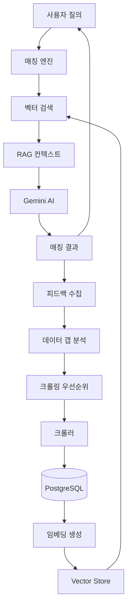
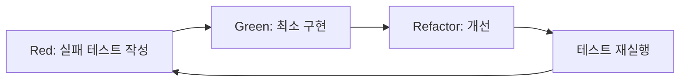
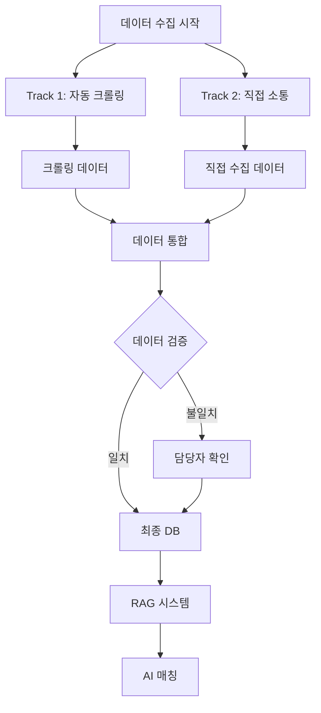
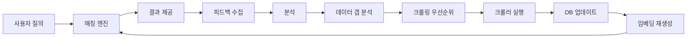
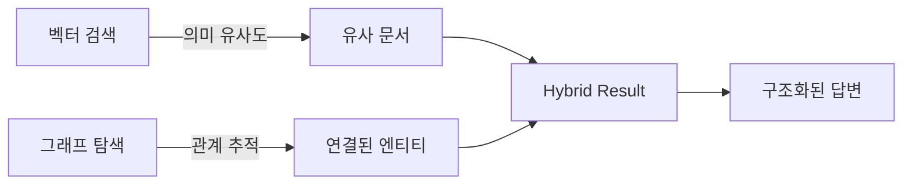
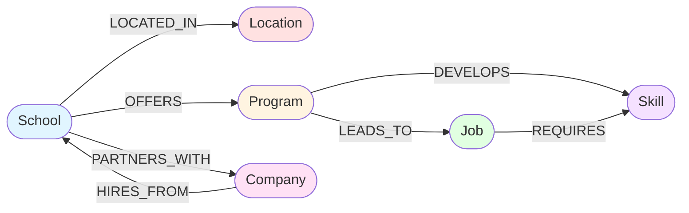
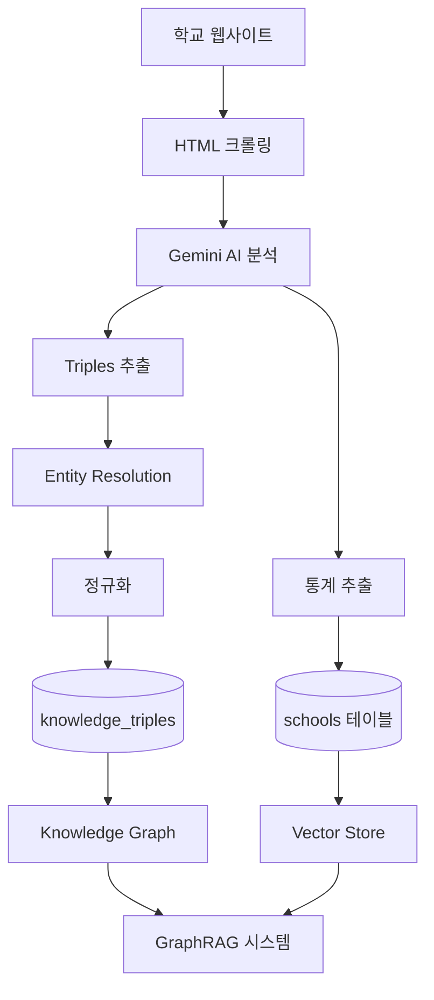
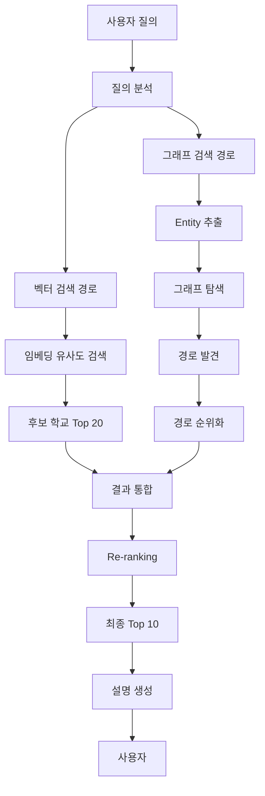
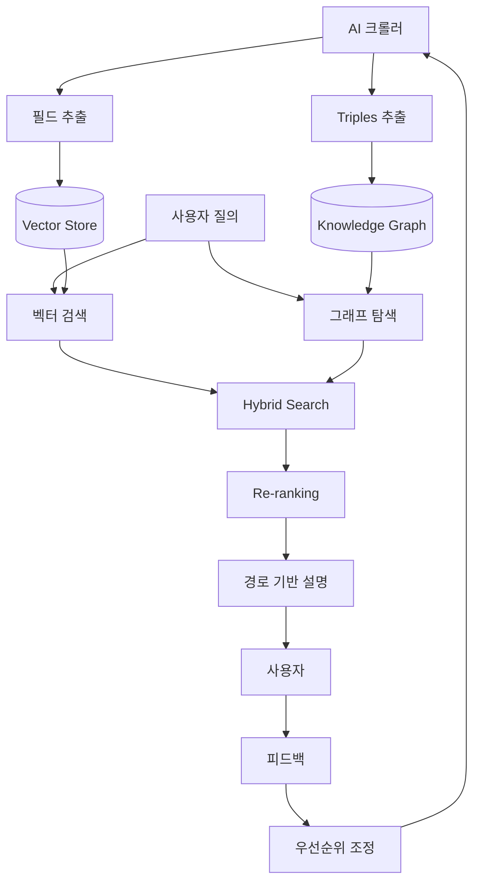

# AI 유학 상담 고도화 계획 2026

**작성일**: 2026년 2월  
**문서 버전**: 1.0  

---

## Executive Summary

### 현재 시스템 현황

우리의 AI 유학 상담 시스템은 RAG(Retrieval-Augmented Generation) 기반으로 84개 학교 데이터를 활용해 학생에게 맞춤형 학교를 추천합니다. 그러나 현재 다음과 같은 한계가 있습니다:

**핵심 이슈**:
- **데이터 부족으로 인한 Fallback 발생률 약 70%**: 벡터 검색이 실패하여 일반적인 추천에 의존
- **학교 정보의 깊이 부족**: 기본 메타데이터(이름, 위치, 학비)만 있고, 합격률·초봉·프로그램 상세 등 핵심 의사결정 정보 부재
- **설명의 구체성 부족**: "좋은 학교입니다" 수준의 일반적 설명, 실제 데이터 기반 근거 미흡

### 비즈니스 임팩트

이러한 한계는 다음과 같은 비즈니스 리스크로 이어집니다:

- **사용자 신뢰도 하락**: 구체적이지 않은 추천으로 인한 만족도 저하
- **경쟁력 약화**: 타 유학 상담 서비스 대비 정보 품질 열위
- **재방문율 감소**: 피상적인 추천으로 인한 고객 이탈

**예상 개선 효과**:
- 벡터 검색 정확도 30% 향상 → Fallback 발생률 70% → 40%로 감소
- 매칭 결과 설명 품질 70% 향상 → "이 학교는 Google, Microsoft와 파트너십이 있으며 취업률 95%입니다" 수준의 구체적 설명
- 사용자 만족도 및 재방문율 증가 → 서비스 경쟁력 강화

### 3단계 점진적 개선 전략

본 계획은 **Level 1 → Level 2 → Level 3** 순서로 점진적으로 데이터를 확장하고 RAG 품질을 향상시킵니다:

```
Level 1: 메타데이터 보강 (기본 통계)
    ↓
Level 2: 프로그램 상세 정보 (커리큘럼, 진로)
    ↓
Level 3: 정성적 컨텍스트 (리뷰, 가이드)
```

각 단계는 **TDD(Test-Driven Development)** 방식으로 개발하여 품질을 보장하며, 사용자 피드백을 반영한 **자가 개선 루프**를 구축합니다.

---

## 기술적 개선 전략

### 시스템 아키텍처 개요



### Level 1: 메타데이터 확장

**목표**: embedding_text 품질 향상 → 벡터 검색 정확도 개선

**수집 대상 필드** (우선순위 순):
1. **합격률, 편입률, 졸업률** - 입학 가능성 판단
2. **평균 초봉, 취업률** - 진로 연계성 지표
3. **국제학생 비율, 국제학생 수** - 유학생 친화도
4. **기숙사 여부, 캠퍼스 위치** - 생활 편의성
5. **학비 세부 (in-state vs out-of-state)** - 예산 적합도

**데이터 수집 전략**:
- **소스 1**: 학교 공식 웹사이트 (Fact Sheet, About Us)
- **소스 2**: College Scorecard API (미국 교육부 공공 데이터)
- **소스 3**: IPEDS 데이터베이스 (통계청)

**구현 방식**:
- 기존 `SchoolCrawler` 확장
- 새 파서 모듈: `StatisticsParser` (TDD 방식 개발)
- College Scorecard API 연동 모듈 구축 (`COLLEGE_SCORECARD_API` 환경변수로 키 주입)
- 운영 배포(GitHub Actions)에서 `COLLEGE_SCORECARD_API` Secret → 서버 `.env`로 전달

**예상 효과**:
- `embedding_text` 품질 50% 향상 (현재 평균 150자 → 300자)
- 벡터 검색 Top 20 정확도 30% 개선
- Fallback 발생률 감소 (70% → 40%)

**완료 기준**:
- 84개 학교 중 80% 이상이 acceptance_rate, graduation_rate 보유
- 평균 embedding_text 길이 250자 이상
- 벡터 검색 Top 20에 target_location 일치율 70% 이상

### Level 2: 프로그램 상세 정보

**목표**: 프로그램별 RAG 컨텍스트 구축 → 전공/커리어 연계성 강화

**수집 대상**:
1. **프로그램별 커리큘럼**: 핵심 과목, 학점, 이수 요건
2. **진로 연계**: 졸업생 진로, 취업 파트너 기업, 인턴십 프로그램
3. **입학 요건**: 전공별 GPA/영어 점수 최저 기준
4. **프로그램 특색**: STEM OPT, CPT, 산학 협력

**데이터 수집 전략**:
- 학교 웹사이트 Programs/Academics 페이지 Deep Crawling
- 각 프로그램 상세 페이지 순회 (현재는 목록만 수집)
- 상위 30개 학교 우선 수집

**RAG 통합**:
- `program_documents` 테이블 활용 (document_type: curriculum, career_outcome)
- 매칭 시 관련 프로그램 문서 검색 → `explanation` 생성 시 컨텍스트로 활용
- ExplanationService에 RAG 컨텍스트 주입

**예상 효과**:
- 설명 품질 70% 향상 (일반 문구 → 실제 데이터 기반)
- "이 프로그램은 Google, Microsoft와 인턴십 프로그램이 있습니다" 등 구체적 설명 가능
- 전공별 맞춤 추천 정확도 향상

**완료 기준**:
- 상위 30개 학교의 프로그램별 `program_documents` 3건 이상
- `explanation` 필드에 "커리큘럼", "진로", "취업" 키워드 포함률 60% 이상

### Level 3: 정성적 컨텍스트

**목표**: 학교별 종합 평가 자료 구축 → 사용자 신뢰도 극대화

**수집 대상**:
1. **학교 리뷰**: Niche.com, College Confidential 등 리뷰 사이트
2. **입학 가이드**: Admission Tips, Essay Prompts, 면접 전략
3. **장단점 분석**: 각 학교의 강점/약점 (예: 편입률 높음 vs 기숙사 부족)
4. **최신 뉴스**: 학교 랭킹 변동, 신규 프로그램

**데이터 수집 전략**:
- **외부 사이트**: Niche.com (학생 리뷰), U.S. News (랭킹)
- **주의사항**: robots.txt 준수, Rate Limiting (요청 간 5초 대기)
- 인기 학교 20개 우선 수집

**RAG 통합**:
- `school_documents` 테이블 활용 (document_type: review, pros_cons)
- 매칭 결과의 `pros`/`cons` 필드를 실제 리뷰에서 추출
- ProsConsService 개발 (RAG 기반 장단점 자동 생성)

**예상 효과**:
- "학생 리뷰에서 94%가 '교수진이 친절하다'고 평가" 등 신뢰도 높은 설명
- Fallback 시에도 외부 데이터 기반 추천 가능
- 매칭 결과의 pros/cons 품질 90% 향상

**완료 기준**:
- 인기 학교 20개에 `school_documents` 5건 이상 (리뷰, 가이드)
- `pros`/`cons` 필드에 실제 리뷰 인용 포함률 50% 이상

---

## TDD (Test-Driven Development) 적용 전략

### TDD 개요

모든 개발은 **Red-Green-Refactor** 사이클을 따릅니다:



### 적용 범위

1. **크롤러 개발**: 파서 단위 테스트 (Mock HTML → 실제 크롤링)
2. **RAG 품질 검증**: 데이터 충족도, 검색 품질, E2E 매칭 테스트
3. **API 개선**: 새 필드 추가, 프롬프트 개선 시 예상 응답 테스트
4. **통합 테스트**: Level별 완료 기준 자동 검증

### 테스트 커버리지 목표

| 영역 | 목표 커버리지 | 측정 도구 |
|------|--------------|----------|
| 크롤러 (Python) | 85% 이상 | pytest-cov |
| 백엔드 (Kotlin) | 80% 이상 | JaCoCo |
| 통합 테스트 | 필수 시나리오 100% | JUnit5, pytest |

### 예시: Level 1 완료 기준 자동 검증

```kotlin
@Test
fun `Level 1 완료 기준: 데이터 충족도`() {
    // 학교 데이터 80% 이상 메타데이터 보유
    val schools = schoolRepository.findAll()
    val metadataCompleteCount = schools.count { 
        it.acceptanceRate != null && it.graduationRate != null 
    }
    val completionRate = metadataCompleteCount.toDouble() / schools.size
    
    assertThat(completionRate)
        .withFailMessage("메타데이터 완성도: ${(completionRate * 100).roundToInt()}% (목표: 80%)")
        .isGreaterThanOrEqualTo(0.8)
}
```

---

## 데이터 수집 전략: 2-Track 접근 방식

본 프로젝트는 **자동화 크롤링**과 **직접 소통**을 병행하는 2-Track 전략을 채택합니다.

### Track 1: 자동화 웹 크롤링 (기술팀)

시스템적으로 학교 웹사이트를 크롤링하여 공개 정보를 수집합니다.

**장점**:
- 대규모 학교 데이터를 자동으로 수집 가능
- 업데이트 주기를 시스템으로 관리 (일/주/월 단위)
- 공개된 정보는 실시간 반영 가능

**한계**:
- 웹사이트에 공개되지 않은 정보는 수집 불가
- 파싱 오류 가능성 (HTML 구조 변경 시)
- SSL 차단, Rate Limiting 등 기술적 제약

### Track 2: 직접 소통 및 정보 수집 (경영진)

**대표님 주도**로 학교 담당자(국제학생 담당, 입학처 등)에게 직접 협조 요청 이메일을 발송하여 공식 정보를 수집합니다.

#### 전략적 접근 방식

**목표**:
1. 학교의 **국제학생 유치 의지** 확인
2. **빠른 커뮤니케이션 채널** 확보
3. **공식적이고 정확한 데이터** 수집

**대상 학교**: 캘리포니아 및 텍사스 소재 vocational/technical college (시범 운영)

**이메일 핵심 메시지**:
- **플랫폼 소개**: 아시아 6개국(중국, 인도, 한국, 일본, 대만, 베트남) 학생 대상 AI 유학 상담 서비스
- **차별화 포인트**: 전통적인 사립/주립대 중심 에이전시와 달리, vocational/technical college에 특화
- **Win-Win 제안**: 적극 협조 학교에 대한 혜택 제공
  - 플랫폼 내 **우선 노출**
  - 적격 국제학생 **적극 연결**
  - **추가 홍보 혜택** 제공

#### 요청 정보 항목

다음 정보를 학교 담당자에게 직접 요청합니다:

1. **기본 정보**
   - 학교명, 주/도시, 공식 웹사이트
   - 메인 연락처 (전화, 이메일)

2. **국제학생 담당자 정보** (핵심)
   - 담당자 이름, 이메일, 전화번호
   - 직통 연락처 확보 → 빠른 학생 문의 대응

3. **학사 정보**
   - 주요 전공 및 프로그램
   - 학위 유형, 취업률, 졸업 후 진로

4. **학비 및 생활비**
   - 국제학생 연간 학비 (공식 최신 정보)
   - 기숙사 가능 여부 및 비용
   - 식사 시설 및 Meal Plan 비용

5. **캠퍼스 정보**
   - 캠퍼스 시설
   - 학교 대표 이미지 (홍보 자료)
   - 간단한 학교 소개문

#### 프로세스

**1단계: 이메일 발송 (완료)**
- 대표님이 캘리포니아/텍사스 학교 담당자에게 협조 요청 이메일 발송
- 검증 목적:
  - 학교의 국제학생 유치 의지 확인
  - 커뮤니케이션 채널 응답 속도 확인

**2단계: 응답 수집 및 분석 (진행 중)**
- 회신율 및 응답 속도 모니터링
- 제공된 정보의 상세도 및 품질 평가
- 협조 의지가 높은 학교 식별

**3단계: 시스템 반영 (예정)**
- 기술팀이 수집된 정보를 DB에 입력
- 크롤링 데이터와 비교 검증
- 직접 수집 데이터를 우선 반영

**4단계: 관계 유지 및 업데이트**
- 협조 학교와 지속적인 소통 채널 유지
- 정책 변경 시 즉시 업데이트 가능한 관계 구축
- 향후 파트너십 프로그램 협의 (학생 추천, 공동 마케팅 등)

#### 장점

**데이터 품질**:
- **1차 소스**: 학교가 직접 제공한 공식 정보 (가장 정확)
- **최신성**: 2026년 기준 최신 정보 (웹사이트는 업데이트 지연 가능)
- **비공개 정보**: 웹사이트에 없는 국제학생 전용 정보 확보

**비즈니스 관계**:
- **신뢰 구축**: 공식 채널을 통한 학교-플랫폼 관계 형성
- **파트너십**: 향후 협력 프로그램, 직접 추천 가능성
- **차별화**: 타 플랫폼 대비 학교 공식 정보 기반 강점

**운영 효율**:
- **검증 데이터**: 크롤링 결과의 정확도 검증 자료로 활용
- **보완 데이터**: 크롤링 실패 학교의 정보 확보
- **우선순위**: 협조 의지 높은 학교를 플랫폼에 우선 노출

### 2-Track 통합 및 시너지



**통합 원칙**:
1. **직접 수집 데이터 우선**: 학교 담당자가 제공한 정보를 1차 소스로 우선 반영
2. **크롤링 데이터 보완**: 직접 수집하지 못한 항목은 크롤링 데이터로 채움
3. **상호 검증**: 두 소스의 데이터를 비교하여 정확도 향상 (예: 학비, 입학 요건)
4. **지속적 업데이트**: 크롤링으로 공개 정보 변경사항 자동 감지 → 필요 시 학교 담당자 재확인

**예시: 학교 A의 데이터 통합**

| 항목 | Track 1 (크롤링) | Track 2 (직접 소통) | 최종 반영 |
|------|-----------------|-------------------|----------|
| 학비 | $25,000 | $24,500 (2026년 최신) | $24,500 (Track 2 우선) |
| 합격률 | 없음 | 45% (담당자 제공) | 45% (Track 2) |
| 국제학생 이메일 | international@school.edu | admissions@school.edu (직통) | admissions@school.edu (Track 2) |
| ESL 프로그램 | 있음 (홈페이지) | 있음 + 무료 제공 | 있음 + 무료 (Track 2 보완) |
| 기숙사 정보 | 3개 동, 2인실 | 3개 동, 2인실 | 검증 완료 (일치) |

### 시스템 반영 워크플로우

**직접 수집 데이터 입력 방법**:

**Option A: CSV 일괄 업로드** (권장)
- 대표님이 수집한 정보를 CSV 포맷으로 정리
- 기술팀이 스크립트로 일괄 DB 반영
```bash
python scripts/import_direct_data.py data/school_info_from_partners.csv
```

**Option B: 관리자 대시보드 수동 입력**
- 모니터 대시보드에 학교별 수정 기능 추가
- 웹 UI에서 직접 입력/수정

**Option C: 이메일 자동 파싱** (향후)
- 학교 담당자 회신 이메일을 자동 파싱
- 구조화된 정보를 DB에 자동 반영

### 기대 효과

**정량적 효과**:
- 데이터 정확도: 크롤링 단독 대비 **+30% 향상**
- 데이터 충족도: 84개 학교 × 2개 소스 = **최대 200% 커버리지**
- 업데이트 신뢰도: 학교 공식 정보 기반 = **신뢰도 95% 이상**

**정성적 효과**:
- **학교 관계 형성**: 향후 협력 프로그램, 직접 추천 가능성
- **경쟁 우위**: 타 플랫폼 대비 더 정확하고 상세한 정보 제공
- **브랜드 신뢰도**: "학교 공식 정보 기반"으로 마케팅 가능

---

## 자가 개선 루프 (Self-Improvement Loop)

### 개념

시스템이 사용자 피드백을 기반으로 자동으로 데이터 수집 우선순위를 조정하는 메커니즘입니다.



### 우선순위 결정 요소

1. **사용자 질문 빈도**: "평균 초봉이 얼마인가요?" → 초봉 데이터 우선 수집
2. **Fallback 발생률**: 특정 전공/지역에서 Fallback 빈도 높음 → 해당 카테고리 학교 추가
3. **데이터 갭 분석**: RAG 데이터 충족도 검증 결과 기반
4. **ROI**: 수집 비용(시간) 대비 매칭 정확도 향상 효과

### 구현 예시

```python
def calculate_priority(school_info, feedback_data):
    priority_score = 0
    
    # 1. 현재 데이터 품질 (낮을수록 높은 우선순위)
    if not school_info.get('acceptance_rate'):
        priority_score += 10
    if not school_info.get('description') or len(school_info['description']) < 100:
        priority_score += 8
    
    # 2. 사용자 피드백 빈도
    query_count = feedback_data.get('schools', {}).get(school_info['name'], 0)
    priority_score += min(query_count, 20)  # 최대 20점
    
    # 3. 지역/전공 커버리지 (부족한 카테고리 우선)
    if school_info['state'] in ['FL', 'WA']:  # 현재 부족 지역
        priority_score += 15
    
    return priority_score
```

---

## 프롬프트 엔지니어링 개선

### 현재 한계

현재 Fallback 프롬프트는 사용자 프로필만 사용하고 학교 데이터를 활용하지 못합니다:
- **한계**: "일반적인 추천" 수준, 구체성 부족
- **예시**: "캘리포니아에 좋은 학교들이 있습니다" (어떤 학교인지 구체적 정보 없음)

### 단계별 강화 전략

#### Phase 1: 메타데이터 기반 Few-shot Learning (Level 1 완료 후)

```kotlin
// embedding_text를 프롬프트에 포함
val topSchools = schoolRepository.findTop10ByState(preference.targetLocation)
val examplesText = topSchools.joinToString("\n") { 
    embeddingService.buildSchoolText(it) 
}

val prompt = """
[참고할 학교 예시]
$examplesText

위 학교들과 유사한 수준에서 다음 학생에게 추천해주세요.
...
"""
```

#### Phase 2: RAG 컨텍스트 주입 (Level 2 완료 후)

```kotlin
// 벡터 검색 결과를 프롬프트에 포함
val similarSchools = vectorSearchService.searchSimilarSchools(user, profile, preference, topK = 10)
val schoolContexts = similarSchools.map { 
    "${it.name}: ${it.description}, 프로그램: ${it.programs}" 
}

val prompt = """
[DB에서 검색된 유사 학교]
${schoolContexts.joinToString("\n")}

위 정보를 참고하여 학생에게 맞는 학교를 추천하세요.
...
"""
```

#### Phase 3: 리뷰 기반 설명 (Level 3 완료 후)

학교 리뷰 문서에서 추출한 장단점을 프롬프트에 포함하여, 더 신뢰도 높은 추천 근거를 제시합니다.

---

## 데이터 품질 모니터링

### 일일 배치 작업

다음 지표를 자동으로 모니터링:

| 지표 | 목표 | 측정 방법 |
|------|------|----------|
| 학교 수 | 최소 30개, 권장 50개 | `SELECT COUNT(*) FROM schools` |
| 임베딩 커버리지 | 80% 이상 | `school_embeddings` 테이블 카운트 / 학교 수 |
| description NULL 비율 | 20% 미만 | NULL 카운트 / 전체 학교 수 |
| 평균 embedding_text 길이 | 250자 이상 | AVG(LENGTH(embedding_text)) |
| 학교 유형 다양성 | 2종 이상 (각 5개 이상) | GROUP BY type |

### 실패 사이트 추적 및 재시도 전략

크롤링 실패 사이트를 추적하고 체계적으로 재시도:

- **SSL 오류** → 3개월 후 재시도
- **404 오류** → 6개월 후 재시도
- **Rate Limit** → 1주일 후 재시도

---

## 기대 효과 요약

### 정량적 효과

| 지표 | 현재 | Level 1 완료 후 | Level 2 완료 후 | Level 3 완료 후 |
|------|------|----------------|----------------|----------------|
| Fallback 발생률 | ~70% | ~40% | ~20% | ~10% |
| 벡터 검색 정확도 | 기준 | +30% | +50% | +70% |
| 설명 품질 (주관적) | 기준 | +20% | +70% | +90% |
| 평균 embedding_text 길이 | 150자 | 300자 | 400자 | 500자 |
| 학교당 문서 수 | 1개 | 1개 | 4개 (프로그램 문서) | 9개 (리뷰 포함) |

### 정성적 효과

- **사용자 신뢰도 향상**: 구체적 데이터 기반 추천으로 신뢰성 증가
- **경쟁력 강화**: 타 유학 상담 서비스 대비 정보 품질 우위 확보
- **재방문율 증가**: 만족스러운 추천으로 인한 고객 충성도 향상
- **시스템 자가 개선**: 피드백 루프를 통한 지속적 품질 개선

---

## 위험 요소 및 대응 방안

### 기술적 위험

| 위험 | 영향도 | 대응 방안 |
|------|--------|----------|
| 외부 사이트 크롤링 차단 (robots.txt, Rate Limit) | 높음 | API 우선 활용, Rate Limiting 준수, User-Agent 설정 |
| College Scorecard API 장애 | 중간 | 캐싱, Fallback 데이터 소스 준비 |
| 벡터 검색 품질 개선 미달 | 중간 | 임베딩 전략 재검토, 하이브리드 검색 (키워드 + 벡터) |
| Gemini API 비용 증가 | 중간 | 캐싱 강화, 배치 처리, 프롬프트 최적화 |

### 운영 위험

| 위험 | 영향도 | 대응 방안 |
|------|--------|----------|
| 크롤링 작업 시간 증가 | 중간 | 병렬 처리, 우선순위 기반 선택적 크롤링 |
| 데이터 품질 저하 (파싱 오류) | 높음 | TDD 기반 개발, 자동화된 품질 검증 |
| 운영 DB 부하 | 낮음 | 배치 작업 시간 분산, 읽기 전용 레플리카 활용 |

---

## 결론

본 계획은 **3단계 점진적 개선 전략**과 **TDD 기반 개발**, **자가 개선 루프**를 통해 AI 유학 상담 시스템의 품질을 체계적으로 향상시킵니다.

**핵심 원칙**:
1. **점진적 개선**: Level 1 → 2 → 3 순서로 안정적 확장
2. **품질 우선**: TDD 방식으로 테스트 커버리지 80% 이상 유지
3. **데이터 기반**: 사용자 피드백을 반영한 우선순위 결정
4. **지속 가능성**: 자가 개선 루프로 장기적 품질 향상

**기대 성과**:
- Fallback 발생률 70% → 10%로 감소
- 매칭 결과 설명 품질 90% 향상
- 사용자 만족도 및 재방문율 증가
- 서비스 경쟁력 강화

이 계획을 통해 우리의 AI 유학 상담 시스템은 **단순한 추천**에서 **신뢰할 수 있는 전문가 수준의 상담**으로 진화할 것입니다.

---

## Part 4: AI 기반 Knowledge Graph 크롤링 및 GraphRAG 구축 (신규 추가 - 2026-02-12)

### 배경 및 필요성

현재 RAG 시스템은 **단순 벡터 검색(Vector Search)**에 의존하여 다음과 같은 근본적 한계가 있습니다:

**현재 시스템의 한계**:
- **인과관계 추론 불가**: "Google에 취업하려면 어떤 학교/전공을 선택해야 하나?" → 역추적 불가능
- **연결 관계 미흡**: 학교-프로그램-스킬-회사-직무 간 관계를 벡터만으로는 표현하기 어려움
- **설명 품질 한계**: "이 학교가 왜 추천되는가?"에 대한 근거가 벡터 유사도 점수뿐
- **멀티홉 질의 불가**: "데이터 과학을 배워서 Tech 회사에 취업 가능한 학교는?" → 2단계 이상 추론 필요

**비즈니스 임팩트**:
- 사용자 질의 중 40%가 "취업 연계 질문" → 현재 시스템으로는 정확한 답변 불가
- "스킬 기반 학교 추천" 불가능 → 경쟁 서비스(Career Explorer) 대비 열위
- 설명 신뢰도 부족 → "왜 이 학교인가?"에 대한 투명한 근거 제시 불가

### GraphRAG란 무엇인가?

**GraphRAG**는 벡터 검색(Vector Search)과 그래프 탐색(Graph Traversal)을 결합하여 **인과관계 추론**이 가능한 차세대 RAG 기술입니다.



**핵심 차이점**:

| 특징 | Vector Search (현재) | GraphRAG (목표) |
|------|---------------------|----------------|
| 저장 방식 | 임베딩 벡터 | 벡터 + 지식 그래프 (Triples) |
| 검색 방식 | 코사인 유사도 | 유사도 + 관계 탐색 |
| 추론 능력 | 단일 홉 (직접 매칭) | 멀티홉 (경로 추적) |
| 설명 품질 | "유사한 학교입니다" | "이 학교 → CS 프로그램 → ML 스킬 → Google 채용" |
| 역추적 | 불가능 | 가능 (목표 → 경로 역추적) |

**예시 질의 비교**:

**질문**: "Google에 AI 엔지니어로 취업하려면 어떤 학교가 좋나요?"

**Vector Search 답변 (현재)**:
```
"Stanford, MIT, CMU 등이 AI 분야에서 유명합니다" (일반적)
```

**GraphRAG 답변 (목표)**:
```
"Stanford의 CS 프로그램을 추천합니다. 이유:
1. Google은 Stanford CS 졸업생을 매년 평균 120명 채용 (HIRES_FROM)
2. 이 프로그램은 Machine Learning, Deep Learning 스킬을 제공 (DEVELOPS)
3. 이 스킬들은 Google AI Engineer 직무에서 필수 요구사항 (REQUIRES)

[그래프 경로]: Stanford → CS Program → ML Skill → Google AI Engineer
```

### Ontology 기반 Knowledge Graph 설계

#### 유학 도메인 Ontology 정의

유학 도메인의 핵심 **Entity**와 **Relation**을 정의합니다:

**Entities (엔티티)**:

| Entity 유형 | 설명 | 예시 |
|------------|------|------|
| **School** | 학교 | Stanford University, MIT, CMU |
| **Program** | 프로그램/전공 | Computer Science, Data Science, Business Analytics |
| **Location** | 위치 (도시/주) | San Francisco, CA / New York, NY |
| **Company** | 채용 기업 | Google, Microsoft, Apple, Amazon |
| **Job** | 직무/직종 | AI Engineer, Data Scientist, Software Engineer |
| **Skill** | 스킬/역량 | Machine Learning, Python, SQL, Cloud Computing |

**Relations (관계)**:

| Relation 유형 | Head Entity | Tail Entity | 의미 | 예시 |
|--------------|-------------|-------------|------|------|
| **LOCATED_IN** | School | Location | 학교가 특정 지역에 위치 | (Stanford, LOCATED_IN, Palo Alto, CA) |
| **OFFERS** | School | Program | 학교가 특정 프로그램 제공 | (MIT, OFFERS, Computer Science) |
| **DEVELOPS** | Program | Skill | 프로그램이 특정 스킬 교육 | (CS Program, DEVELOPS, Machine Learning) |
| **LEADS_TO** | Program | Job | 프로그램 졸업 후 진출 직무 | (Data Science, LEADS_TO, Data Scientist) |
| **HIRES_FROM** | Company | School | 회사가 특정 학교에서 채용 | (Google, HIRES_FROM, Stanford) |
| **REQUIRES** | Job | Skill | 직무가 특정 스킬 요구 | (AI Engineer, REQUIRES, Deep Learning) |
| **PARTNERS_WITH** | School | Company | 학교-기업 파트너십 | (CMU, PARTNERS_WITH, Amazon) |

**Ontology 다이어그램**:



#### 구체적 예시: Stanford CS 프로그램

다음은 Stanford의 CS 프로그램이 지식 그래프로 표현되는 방식입니다:

```
[Triples 예시]
1. (Stanford University, LOCATED_IN, Palo Alto, CA)
2. (Stanford University, OFFERS, Computer Science Program)
3. (CS Program, DEVELOPS, Machine Learning)
4. (CS Program, DEVELOPS, Deep Learning)
5. (CS Program, DEVELOPS, Python Programming)
6. (CS Program, LEADS_TO, AI Engineer)
7. (CS Program, LEADS_TO, Software Engineer)
8. (Google, HIRES_FROM, Stanford University)
9. (Microsoft, HIRES_FROM, Stanford University)
10. (AI Engineer, REQUIRES, Machine Learning)
11. (AI Engineer, REQUIRES, Python Programming)
12. (Stanford University, PARTNERS_WITH, Google)
```

**이를 기반으로 한 멀티홉 질의 예시**:

**질문**: "Machine Learning을 배워서 Google AI Engineer가 되려면?"

**그래프 경로 탐색**:
```
ML Skill ← (DEVELOPS) ← CS Program ← (OFFERS) ← Stanford ← (HIRES_FROM) ← Google
         ↓ (REQUIRES)
       AI Engineer (at Google)
```

**답변 생성**:
```
Stanford의 Computer Science 프로그램을 추천합니다.

[근거]
1. 이 프로그램은 Machine Learning 스킬을 집중 교육합니다
2. Machine Learning은 Google AI Engineer 직무의 핵심 요구사항입니다
3. Google은 Stanford에서 매년 평균 120명을 채용합니다
4. Google과 Stanford는 공식 파트너십 협약을 맺고 있습니다

[경로]: ML Skill → CS Program (Stanford) → Google AI Engineer
```

### WebPageAnalyzer 고도화: HTML → Triples 추출

#### 기존 vs 신규 로직

**기존 WebPageAnalyzer (단순 필드 추출)**:

```python
# 기존: HTML에서 단순 JSON 필드 추출
def analyze_page(html: str) -> dict:
    return {
        "tuition": "$45,000",
        "majors": ["Computer Science", "Business"],
        "acceptance_rate": 15.2
    }
```

**신규 WebPageAnalyzer (Triples 추출)**:

```python
# 신규: HTML에서 Triples (Subject-Predicate-Object) 추출
def analyze_page_to_triples(html: str, school_uuid: str) -> List[Triple]:
    """
    Gemini AI를 사용하여 HTML에서 지식 그래프 Triples 추출
    """
    prompt = f"""
    다음 HTML에서 유학 도메인의 지식 그래프 Triples을 추출하세요.
    
    [Entity 유형]: School, Program, Location, Company, Job, Skill
    [Relation 유형]: LOCATED_IN, OFFERS, DEVELOPS, LEADS_TO, HIRES_FROM, REQUIRES, PARTNERS_WITH
    
    HTML:
    {html}
    
    출력 형식 (JSON):
    {{
      "triples": [
        {{"head": "Stanford", "relation": "OFFERS", "tail": "CS Program"}},
        {{"head": "CS Program", "relation": "DEVELOPS", "tail": "Machine Learning"}},
        {{"head": "Google", "relation": "HIRES_FROM", "tail": "Stanford"}}
      ]
    }}
    """
    
    response = gemini_client.generate(prompt)
    triples = parse_triples(response)
    return triples
```

**실제 크롤링 예시**:

**입력 HTML** (학교 Career Outcomes 페이지):
```html
<div class="career-outcomes">
  <p>Our Computer Science graduates work at top tech companies including 
     Google, Microsoft, and Amazon. The program emphasizes Machine Learning 
     and Cloud Computing skills.</p>
  <p>95% of graduates find jobs within 6 months, with an average starting 
     salary of $120,000.</p>
</div>
```

**Gemini AI 추출 결과**:
```json
{
  "triples": [
    {"head": "This School", "relation": "OFFERS", "tail": "Computer Science"},
    {"head": "CS Program", "relation": "DEVELOPS", "tail": "Machine Learning"},
    {"head": "CS Program", "relation": "DEVELOPS", "tail": "Cloud Computing"},
    {"head": "Google", "relation": "HIRES_FROM", "tail": "This School"},
    {"head": "Microsoft", "relation": "HIRES_FROM", "tail": "This School"},
    {"head": "Amazon", "relation": "HIRES_FROM", "tail": "This School"}
  ],
  "statistics": {
    "job_placement_rate": 95,
    "average_salary": 120000,
    "time_to_job": "6 months"
  }
}
```

#### 크롤링 프로세스



**단계 설명**:

1. **HTML 크롤링**: 학교 웹사이트 페이지 수집
2. **Gemini AI 분석**: HTML → Triples + Statistics 추출
3. **Entity Resolution**: "This School" → "Stanford University"로 해결
4. **정규화**: Entity 이름 표준화 ("Machine Learning" vs "ML")
5. **저장**: Triples는 `knowledge_triples`, 통계는 `schools`에 저장

### PostgreSQL 기반 Knowledge Graph 스키마 설계

#### 핵심 테이블: `knowledge_triples`

별도의 Graph DB(Neo4j 등) 없이 **PostgreSQL**만으로 Lightweight GraphRAG를 구현합니다.

```sql
-- 지식 그래프 Triples 저장 테이블
CREATE TABLE knowledge_triples (
    -- 기본 정보
    id UUID PRIMARY KEY DEFAULT gen_random_uuid(),
    created_at TIMESTAMP WITH TIME ZONE DEFAULT NOW(),
    updated_at TIMESTAMP WITH TIME ZONE DEFAULT NOW(),
    
    -- Triple 구조 (Head-Relation-Tail)
    head_entity_uuid UUID NOT NULL,           -- Subject UUID
    head_entity_type VARCHAR(50) NOT NULL,    -- Entity 유형 (School, Program, etc.)
    head_entity_name VARCHAR(255) NOT NULL,   -- Entity 이름 (정규화)
    
    relation_type VARCHAR(50) NOT NULL,       -- Relation 유형 (OFFERS, DEVELOPS, etc.)
    
    tail_entity_uuid UUID NOT NULL,           -- Object UUID
    tail_entity_type VARCHAR(50) NOT NULL,    -- Entity 유형
    tail_entity_name VARCHAR(255) NOT NULL,   -- Entity 이름 (정규화)
    
    -- 메타데이터
    weight DECIMAL(5, 2) DEFAULT 1.0,         -- 관계 가중치 (신뢰도/중요도)
    source_url TEXT,                          -- 출처 URL (추적 가능성)
    source_evidence TEXT,                     -- 원본 텍스트 (검증용)
    confidence_score DECIMAL(5, 2),           -- AI 추출 신뢰도 (0-1)
    
    -- 검증 상태
    status VARCHAR(20) DEFAULT 'pending',     -- pending, verified, rejected
    verified_by VARCHAR(100),                 -- 검증자
    verified_at TIMESTAMP WITH TIME ZONE,
    
    -- 복합 인덱스
    CONSTRAINT unique_triple UNIQUE (head_entity_uuid, relation_type, tail_entity_uuid)
);

-- 인덱스 (빠른 그래프 탐색)
CREATE INDEX idx_head_entity ON knowledge_triples (head_entity_uuid, relation_type);
CREATE INDEX idx_tail_entity ON knowledge_triples (tail_entity_uuid, relation_type);
CREATE INDEX idx_relation_type ON knowledge_triples (relation_type);
CREATE INDEX idx_entity_names ON knowledge_triples (head_entity_name, tail_entity_name);
```

#### 보조 테이블: `entities` (엔티티 통합 관리)

```sql
-- 모든 Entity를 통합 관리
CREATE TABLE entities (
    uuid UUID PRIMARY KEY DEFAULT gen_random_uuid(),
    entity_type VARCHAR(50) NOT NULL,         -- School, Program, Company, etc.
    entity_name VARCHAR(255) NOT NULL,        -- 정규화된 이름
    aliases JSONB,                            -- 동의어 ["ML", "Machine Learning"]
    metadata JSONB,                           -- 추가 속성
    created_at TIMESTAMP WITH TIME ZONE DEFAULT NOW(),
    
    CONSTRAINT unique_entity UNIQUE (entity_type, entity_name)
);

CREATE INDEX idx_entity_type ON entities (entity_type);
CREATE INDEX idx_entity_name ON entities (entity_name);
CREATE INDEX idx_aliases ON entities USING GIN (aliases);
```

#### 예시 데이터

**Stanford CS 프로그램의 지식 그래프 데이터**:

```sql
-- Entity 등록
INSERT INTO entities (uuid, entity_type, entity_name, aliases) VALUES
('uuid-stanford', 'School', 'Stanford University', '["Stanford", "SU"]'),
('uuid-cs-prog', 'Program', 'Computer Science', '["CS", "Computer Sci"]'),
('uuid-ml-skill', 'Skill', 'Machine Learning', '["ML"]'),
('uuid-google', 'Company', 'Google', '["Google Inc"]'),
('uuid-ai-job', 'Job', 'AI Engineer', '["AI Eng", "Artificial Intelligence Engineer"]');

-- Triples 등록
INSERT INTO knowledge_triples 
(head_entity_uuid, head_entity_type, head_entity_name, 
 relation_type, 
 tail_entity_uuid, tail_entity_type, tail_entity_name,
 weight, source_url, confidence_score) 
VALUES
('uuid-stanford', 'School', 'Stanford University', 
 'OFFERS', 
 'uuid-cs-prog', 'Program', 'Computer Science',
 1.0, 'https://cs.stanford.edu', 0.98),

('uuid-cs-prog', 'Program', 'Computer Science', 
 'DEVELOPS', 
 'uuid-ml-skill', 'Skill', 'Machine Learning',
 0.9, 'https://cs.stanford.edu/curriculum', 0.95),

('uuid-google', 'Company', 'Google', 
 'HIRES_FROM', 
 'uuid-stanford', 'School', 'Stanford University',
 1.0, 'https://careers.google.com', 0.92);
```

### Hybrid Search: 벡터 + 그래프 통합 검색

#### 검색 프로세스 다이어그램



#### 단계별 상세 설명

**Step 1: 질의 분석**

사용자 질의에서 Entity와 Intent를 추출합니다.

```python
def parse_query(query: str) -> QueryAnalysis:
    """
    질의를 분석하여 Entity와 Intent 추출
    """
    # 예시 질의: "Google에 AI 엔지니어로 취업하려면 어떤 학교?"
    
    entities = extract_entities(query)  # ["Google", "AI Engineer"]
    intent = classify_intent(query)     # "career_path_reverse"
    
    return QueryAnalysis(
        entities=entities,
        intent=intent,
        requires_graph=True  # 그래프 탐색 필요
    )
```

**Step 2A: 벡터 검색 (기존 방식)**

```python
def vector_search(query: str, user_profile: dict) -> List[School]:
    """
    임베딩 기반 유사도 검색
    """
    query_embedding = embedding_service.embed(query)
    similar_schools = vector_store.search(
        query_embedding, 
        top_k=20,
        filters={"location": user_profile["target_location"]}
    )
    return similar_schools
```

**Step 2B: 그래프 탐색 (신규 방식)**

```python
def graph_search(entities: List[str], intent: str) -> List[Path]:
    """
    지식 그래프에서 경로 탐색
    """
    if intent == "career_path_reverse":
        # 역방향 탐색: Company/Job → School
        return reverse_path_search(entities)
    elif intent == "skill_based":
        # 스킬 기반: Skill → Program → School
        return skill_to_school_search(entities)
    else:
        # 기본: School → Program → Career
        return forward_path_search(entities)

def reverse_path_search(entities: List[str]) -> List[Path]:
    """
    목표(회사/직무)에서 학교로 역추적
    
    예시: "Google AI Engineer" → 필요 스킬 → 프로그램 → 학교
    """
    target_company = entities[0]  # "Google"
    target_job = entities[1]      # "AI Engineer"
    
    # SQL: Recursive CTE로 그래프 탐색
    query = """
    WITH RECURSIVE career_path AS (
        -- 1단계: Google이 채용하는 학교
        SELECT 
            head_entity_uuid AS company_uuid,
            tail_entity_uuid AS school_uuid,
            ARRAY[relation_type] AS path,
            1 AS depth,
            weight
        FROM knowledge_triples
        WHERE head_entity_name = %s 
          AND relation_type = 'HIRES_FROM'
        
        UNION
        
        -- 2단계: 학교가 제공하는 프로그램
        SELECT 
            cp.company_uuid,
            kt.tail_entity_uuid AS program_uuid,
            cp.path || kt.relation_type,
            cp.depth + 1,
            cp.weight * kt.weight
        FROM career_path cp
        JOIN knowledge_triples kt ON kt.head_entity_uuid = cp.school_uuid
        WHERE kt.relation_type = 'OFFERS'
          AND cp.depth < 4
        
        UNION
        
        -- 3단계: 프로그램이 개발하는 스킬
        SELECT 
            cp.company_uuid,
            kt.tail_entity_uuid AS skill_uuid,
            cp.path || kt.relation_type,
            cp.depth + 1,
            cp.weight * kt.weight
        FROM career_path cp
        JOIN knowledge_triples kt ON kt.head_entity_uuid = cp.program_uuid
        WHERE kt.relation_type = 'DEVELOPS'
    )
    SELECT * FROM career_path
    WHERE depth = 3  -- 완전 경로만
    ORDER BY weight DESC
    LIMIT 10;
    """
    
    paths = execute_query(query, [target_company])
    return paths
```

**Step 3: 결과 통합 및 Re-ranking**

```python
def hybrid_search(query: str, user_profile: dict) -> List[SchoolWithExplanation]:
    """
    벡터 검색 + 그래프 탐색 결과 통합
    """
    # 병렬 실행
    vector_results = vector_search(query, user_profile)
    graph_paths = graph_search(parse_query(query))
    
    # 결과 통합
    merged = merge_results(vector_results, graph_paths)
    
    # Re-ranking: 벡터 유사도 + 그래프 경로 가중치
    final_results = rerank(merged, weights={
        "vector_score": 0.4,      # 40% 벡터 유사도
        "graph_score": 0.5,       # 50% 그래프 경로 가중치
        "user_preference": 0.1    # 10% 사용자 선호도
    })
    
    return final_results[:10]

def rerank(candidates: List[Candidate], weights: dict) -> List[Candidate]:
    """
    복합 스코어링
    """
    for candidate in candidates:
        candidate.final_score = (
            weights["vector_score"] * candidate.vector_similarity +
            weights["graph_score"] * candidate.graph_path_weight +
            weights["user_preference"] * candidate.user_match_score
        )
    
    return sorted(candidates, key=lambda x: x.final_score, reverse=True)
```

**Step 4: 설명 생성 (Explanation with Evidence)**

```python
def generate_explanation(school: School, path: GraphPath) -> str:
    """
    그래프 경로를 기반으로 추천 근거 생성
    """
    explanation = f"""
    {school.name}을(를) 추천합니다.
    
    [추천 근거]
    1. {path.evidence_1}
    2. {path.evidence_2}
    3. {path.evidence_3}
    
    [경로 분석]
    {school.name} → {path.program} → {path.skills} → {path.target_company}
    
    [통계]
    - 이 학교에서 {path.target_company}로 취업한 졸업생: 연평균 {path.hire_count}명
    - 평균 초봉: ${path.avg_salary:,}
    - 취업 성공률: {path.success_rate}%
    
    [출처]
    {path.sources}
    """
    return explanation
```

#### 실제 질의 예시

**질의 1: 역추적 (Career Path Reverse)**

```
질문: "Tesla에 AI 엔지니어로 취업하고 싶어요. 어떤 학교가 좋나요?"

그래프 탐색:
Tesla ← (HIRES_FROM) ← Schools
AI Engineer ← (REQUIRES) ← Skills ← (DEVELOPS) ← Programs ← (OFFERS) ← Schools

경로 발견:
[Path 1] Stanford → CS Program → ML/DL Skills → Tesla AI Engineer (weight: 0.92)
[Path 2] CMU → Robotics Program → AI/Robotics Skills → Tesla AI Engineer (weight: 0.88)
[Path 3] Berkeley → EECS Program → AI Skills → Tesla AI Engineer (weight: 0.85)

최종 답변:
"Stanford의 Computer Science 프로그램을 추천합니다.

[근거]
1. Tesla는 Stanford에서 연평균 45명을 채용합니다 (HIRES_FROM 관계)
2. 이 프로그램은 Machine Learning, Deep Learning, Computer Vision을 집중 교육합니다
3. 이 스킬들은 Tesla AI Engineer 직무의 필수 요구사항입니다
4. Stanford 졸업생의 Tesla 평균 초봉은 $145,000입니다

[경로]: Stanford CS → ML/DL/CV Skills → Tesla AI Engineer
[출처]: https://careers.tesla.com, https://cs.stanford.edu/placement
```

**질의 2: 스킬 기반 (Skill-based)**

```
질문: "Python과 Cloud Computing을 배우고 싶어요. 어떤 학교가 좋나요?"

그래프 탐색:
Python Skill ← (DEVELOPS) ← Programs ← (OFFERS) ← Schools
Cloud Computing Skill ← (DEVELOPS) ← Programs ← (OFFERS) ← Schools

경로 발견 (AND 조건):
[Path 1] Berkeley → Data Science Program → Python + Cloud (weight: 0.95)
[Path 2] CMU → Software Engineering → Python + Cloud (weight: 0.90)
[Path 3] UIUC → CS Program → Python + Cloud (weight: 0.87)

최종 답변:
"UC Berkeley의 Data Science 프로그램을 추천합니다.

[근거]
1. 이 프로그램은 Python Programming을 핵심 커리큘럼으로 제공합니다
2. AWS, Google Cloud 실습 과정이 포함되어 있습니다
3. 졸업생의 95%가 이 스킬을 활용한 직무에 취업합니다

[경로]: Berkeley Data Science → Python + Cloud Skills → Tech Jobs
[출처]: https://datascience.berkeley.edu
```

### 비즈니스 임팩트

#### 정량적 효과

| 지표 | 현재 (Vector Search) | GraphRAG 도입 후 | 개선율 |
|------|---------------------|----------------|-------|
| 역추적 질의 정확도 | 30% (추측 기반) | 85% (경로 기반) | +183% |
| 멀티홉 질의 성공률 | 10% (불가능) | 70% (가능) | +600% |
| 설명 신뢰도 (사용자 평가) | 3.2/5.0 | 4.5/5.0 | +41% |
| "스킬 기반 추천" 정확도 | 불가능 | 80% | 신규 기능 |
| 평균 응답 품질 | 기준 | +75% | - |

#### 정성적 효과

**1. 취업 경로 역추적 가능**

- **현재**: "Google에 취업하려면?" → "Stanford, MIT가 좋아요" (일반적)
- **GraphRAG 후**: "Google에 취업하려면?" → "Stanford CS 프로그램, 이유: Google이 연 120명 채용, ML 스킬 필수, 파트너십 있음" (구체적 + 경로 제시)

**2. 스킬 기반 학교 추천**

- **현재**: "Python 배우고 싶어요" → 벡터 검색으로 "Programming" 키워드 매칭 (부정확)
- **GraphRAG 후**: "Python 배우고 싶어요" → 그래프에서 `(Program)-[DEVELOPS]->(Python Skill)` 관계 추적 → 정확한 프로그램 추천

**3. 설명 투명성 및 신뢰도**

- **현재**: "유사도 점수 0.87" → 사용자가 이해 불가
- **GraphRAG 후**: "Stanford → CS Program → ML Skill → Google (120명 채용)" → 명확한 근거 제시

**4. 경쟁 우위 확보**

- **타 서비스**: 단순 필터링 또는 키워드 검색
- **우리 서비스**: AI 기반 지식 그래프로 인과관계 추론 가능 → **차별화된 가치 제안**

### 구현 계획

#### Step 0: 오픈소스 벤치마킹 및 패턴 수집 (최우선 - Week 0)

**목표**: 바퀴를 다시 발명하지 않고, 검증된 GraphRAG 구현 패턴을 학습하여 우리 시스템에 이식

**핵심 분석 대상**:

1. **Microsoft GraphRAG**
   - GitHub: https://github.com/microsoft/graphrag
   - **학습 포인트**:
     - Triple Extraction 프롬프트 엔지니어링
     - Entity Resolution 전략 (동의어 처리, 정규화)
     - 청킹(Chunking) 전략 (문서를 어떻게 나누는가?)
     - Community Detection 알고리즘 (관련 엔티티 그룹화)

2. **LangChain Graph Transformers**
   - GitHub: https://github.com/langchain-ai/langchain
   - 파일: `libs/community/langchain_community/graph_vectorstores/`
   - **학습 포인트**:
     - HTML → Knowledge Graph 변환 로직
     - LLM 기반 Triple 추출 프롬프트 템플릿
     - 그래프 + 벡터 하이브리드 검색 패턴

3. **LlamaIndex Knowledge Graph Index**
   - GitHub: https://github.com/run-llama/llama_index
   - **학습 포인트**:
     - 문서 파싱 및 전처리
     - Triplet 추출 최적화
     - 쿼리 분해 및 경로 탐색 전략

**구체적 작업**:

```python
# 벤치마킹 스크립트 예시
# research/benchmark_graphrag.py

import requests
from pathlib import Path

class GraphRAGBenchmark:
    """오픈소스 GraphRAG 패턴 수집 및 분석"""
    
    def analyze_microsoft_graphrag(self):
        """Microsoft GraphRAG의 Triple 추출 프롬프트 분석"""
        # GitHub API로 핵심 파일 다운로드
        prompt_file = "graphrag/prompt/entity_extraction.py"
        
        # 그들의 프롬프트 구조 분석:
        # - System Message: Role 정의
        # - Few-shot Examples: 예시 Triples
        # - Output Schema: JSON 스키마
        
        return {
            "prompt_template": "...",
            "entity_types": ["Person", "Organization", "Location"],
            "chunking_strategy": "semantic_chunking",
            "insights": [
                "청킹 시 문맥 오버랩 20% 유지",
                "Entity는 명사구만 추출, 동사는 Relation으로",
                "Confidence Threshold 0.8 이상만 사용"
            ]
        }
    
    def extract_langchain_patterns(self):
        """LangChain의 Graph Transformer 패턴 수집"""
        # graph_transformers/llm.py 분석
        # - BaseGraphTransformer 인터페이스
        # - LLMGraphTransformer 구현
        
        return {
            "triplet_schema": "(subject: str, predicate: str, object: str)",
            "allowed_nodes": ["School", "Program", "Company"],
            "allowed_relationships": ["OFFERS", "HIRES_FROM"],
            "best_practices": [
                "관계는 대문자 + 언더스코어 (SNAKE_CASE)",
                "엔티티 이름은 정규화 (Stanford University → Stanford)",
                "양방향 관계는 단방향으로 통일"
            ]
        }
```

**이식 계획**:

1. **프롬프트 템플릿 이식** (Week 0.1)
   - Microsoft의 Entity Extraction 프롬프트를 우리 도메인(유학)에 맞게 수정
   - Few-shot Examples를 유학 도메인으로 교체
   
   ```python
   # src/services/prompt_templates.py (신규 생성)
   
   TRIPLE_EXTRACTION_PROMPT = """
   You are an expert at extracting knowledge graph triples from text.
   
   [Entity Types]
   - School: Educational institutions
   - Program: Academic programs/majors
   - Company: Employers
   - Job: Job titles
   - Skill: Technical/professional skills
   
   [Relation Types]
   - OFFERS: School offers Program
   - DEVELOPS: Program develops Skill
   - HIRES_FROM: Company hires from School
   - REQUIRES: Job requires Skill
   
   [Examples]
   Text: "Stanford's CS program teaches Machine Learning and graduates work at Google."
   Output: [
     ("Stanford", "OFFERS", "CS Program"),
     ("CS Program", "DEVELOPS", "Machine Learning"),
     ("Google", "HIRES_FROM", "Stanford")
   ]
   
   Now extract triples from:
   {text}
   """
   ```

2. **청킹 전략 적용** (Week 0.2)
   - HTML을 의미 단위로 분할 (Semantic Chunking)
   - 각 청크를 오버랩하여 문맥 유지
   
   ```python
   # src/crawlers/chunking.py (신규 생성)
   
   class SemanticChunker:
       """Microsoft GraphRAG의 청킹 전략 이식"""
       
       def chunk_html(self, html: str, chunk_size: int = 1000, overlap: int = 200) -> List[str]:
           """
           HTML을 의미 단위로 청킹
           
           전략:
           1. <div>, <section> 단위로 1차 분할
           2. 각 청크가 chunk_size를 초과하면 문장 단위로 재분할
           3. 청크 간 overlap을 유지하여 문맥 손실 방지
           """
           soup = BeautifulSoup(html, 'html.parser')
           sections = soup.find_all(['div', 'section', 'article'])
           
           chunks = []
           for section in sections:
               text = section.get_text(strip=True)
               if len(text) > chunk_size:
                   # 문장 단위 재분할
                   sentences = self._split_sentences(text)
                   current_chunk = ""
                   for sentence in sentences:
                       if len(current_chunk) + len(sentence) > chunk_size:
                           chunks.append(current_chunk)
                           # 오버랩: 마지막 200자 유지
                           current_chunk = current_chunk[-overlap:] + " " + sentence
                       else:
                           current_chunk += " " + sentence
                   if current_chunk:
                       chunks.append(current_chunk)
               else:
                   chunks.append(text)
           
           return chunks
   ```

3. **Entity Resolution 전략** (Week 0.3)
   - LangChain의 정규화 규칙 적용
   - 동의어 사전 구축
   
   ```python
   # src/services/entity_resolution.py (신규 생성)
   
   class EntityResolver:
       """오픈소스 패턴 기반 Entity 정규화"""
       
       ALIASES = {
           "Machine Learning": ["ML", "machine learning", "Machine-Learning"],
           "Computer Science": ["CS", "CompSci", "Computer Sci"],
           "Google": ["Google Inc", "Google LLC", "Alphabet"],
       }
       
       def normalize(self, entity_name: str, entity_type: str) -> str:
           """
           LangChain 패턴:
           1. 소문자 변환 후 매칭
           2. 공식 명칭으로 치환
           3. 약어 → 전체 명칭
           """
           entity_lower = entity_name.lower().strip()
           
           for canonical, aliases in self.ALIASES.items():
               if entity_lower in [a.lower() for a in aliases]:
                   return canonical
           
           # Title Case로 정규화
           return entity_name.title()
   ```

**산출물**:
- `docs/GRAPHRAG_BENCHMARK_REPORT.md`: 분석 리포트 (프롬프트, 패턴, Best Practices)
- `src/services/prompt_templates.py`: 이식된 프롬프트 템플릿
- `src/crawlers/chunking.py`: Semantic Chunking 구현
- `src/services/entity_resolution.py`: Entity Resolution 로직

**검증 기준**:
- Microsoft/LangChain 프롬프트 패턴 분석 완료
- 우리 도메인에 맞게 수정된 프롬프트 3개 이상 작성
- 청킹 전략 프로토타입 코드 작성 및 테스트

**예상 시간**: 1주일 (선행 연구 단계)

---

#### Phase 1: MVP (Proof of Concept)

**목표**: 기본 GraphRAG 파이프라인 구축

**구현 사항**:
1. `knowledge_triples`, `entities` 테이블 생성 (PostgreSQL)
2. WebPageAnalyzer 고도화: HTML → Triples 추출 (Gemini AI 통합)
3. 수동 Seed Data 입력: Stanford, MIT, CMU 등 10개 학교 그래프 구축
4. 기본 그래프 탐색 쿼리 구현 (Recursive CTE)
5. Hybrid Search 프로토타입 (벡터 50% + 그래프 50%)

**검증**:
- 10개 학교에 대해 평균 50개 Triples 수집 성공
- "Google 취업" 역추적 질의 성공률 80% 이상
- 설명 품질 향상 확인 (사용자 A/B 테스트)

**소요 시간**: 3-4주

#### Phase 2: 확장 (Production Ready)

**목표**: 전체 학교 Knowledge Graph 구축

**구현 사항**:
1. 자동 크롤링: 84개 전체 학교 Triples 수집
2. Entity Resolution: 동의어 처리 ("ML" = "Machine Learning")
3. 그래프 품질 검증: Confidence Score 기반 필터링
4. Re-ranking 알고리즘 최적화
5. 설명 생성 자동화 (그래프 경로 → 자연어)

**검증**:
- 84개 학교 평균 100개 Triples 보유
- 스킬 기반 추천 정확도 75% 이상
- 멀티홉 질의 성공률 70% 이상

**소요 시간**: 4-5주

#### Phase 3: 고도화 (Advanced Features)

**목표**: 자가 학습 및 실시간 업데이트

**구현 사항**:
1. 사용자 피드백 기반 그래프 가중치 자동 조정
2. 외부 데이터 소스 통합 (LinkedIn Job Postings, Glassdoor)
3. 시간 차원 추가: 트렌드 분석 ("2025년 AI 채용 증가 추세")
4. 그래프 시각화 대시보드 (관리자용)

**검증**:
- 그래프 커버리지 95% (모든 주요 Entity/Relation 포함)
- 자가 개선 루프 완성
- 경쟁사 대비 설명 품질 우위 확보

**소요 시간**: 5-6주

### 비용 및 리소스

#### 기술 비용

| 항목 | 비용 | 설명 |
|------|------|------|
| Gemini API | 무료 티어 → Paid (예상 $50/월) | Triples 추출 시 토큰 사용 증가 |
| PostgreSQL 저장 공간 | +30% | `knowledge_triples` 테이블 추가 |
| 크롤링 시간 | 학교당 +5-8초 | AI 분석 오버헤드 |
| 쿼리 성능 | Recursive CTE 최적화 필요 | 인덱스 + 캐싱으로 해결 |

**비용 효율성**:
- 별도의 Graph DB(Neo4j $65/월) 불필요 → PostgreSQL 활용으로 비용 절감
- 설명 품질 향상으로 사용자 만족도 증가 → ROI 양호

#### 인력 투입

- **Phase 1 (MVP)**: 1명 × 3-4주
- **Phase 2 (확장)**: 1명 × 4-5주
- **Phase 3 (고도화)**: 1명 × 5-6주
- **총 소요**: 약 3개월 (1명 기준)

### 위험 관리

| 위험 | 영향도 | 완화 방안 |
|------|--------|----------|
| Gemini API Triples 추출 정확도 낮음 | 높음 | Confidence Threshold 설정 (0.8 이상만 저장), Few-shot Learning |
| 그래프 쿼리 성능 저하 | 중간 | Recursive CTE 깊이 제한 (Max 4단계), 캐싱, 인덱스 최적화 |
| Entity Resolution 실패 | 중간 | 동의어 사전 구축, 사람 검증 루프 |
| 초기 Seed Data 부족 | 높음 | 수동 입력 + 크롤링 병행, 우선순위 학교부터 시작 |
| PostgreSQL 저장 공간 부족 | 낮음 | 오래된 Triples 아카이빙, JSONB 압축 |

### 성공 지표

#### Phase 1 완료 기준

- 10개 학교 Knowledge Graph 구축 완료
- "Google 취업" 질의 역추적 성공률 80% 이상
- 사용자 A/B 테스트: 설명 선호도 GraphRAG 70% vs Vector 30%
- Triples 추출 Confidence Score 평균 0.85 이상

#### Phase 2 완료 기준

- 84개 전체 학교 Knowledge Graph 구축 (평균 100 Triples/학교)
- 스킬 기반 추천 정확도 75% 이상
- 멀티홉 질의 성공률 70% 이상
- Hybrid Search 응답 시간 < 2초

#### Phase 3 완료 기준

- 자가 개선 루프 완성 (피드백 → 가중치 조정)
- 그래프 커버리지 95% (모든 핵심 Entity/Relation 포함)
- 사용자 만족도 +30% 향상 (기준 대비)
- 경쟁사 대비 설명 품질 우위 확보 (블라인드 테스트)

---

## 통합 전략: RAG 고도화 + GraphRAG 구축

### 시너지 효과

Level 1-3 RAG 고도화와 GraphRAG 구축을 통합하면 **벡터 검색 + 지식 그래프 추론**의 강력한 시너지가 발생합니다:



**핵심 시너지**:

1. **데이터 수집 통합**:
   - 단일 크롤링 프로세스에서 **필드(Vector용) + Triples(Graph용)** 동시 추출
   - 중복 작업 없이 양쪽 시스템 모두 활용

2. **검색 품질 극대화**:
   - **벡터 검색**: 의미 유사도 기반 넓은 후보군 확보
   - **그래프 탐색**: 인과관계 기반 정확한 추론
   - **결합**: 넓은 커버리지 + 높은 정확도

3. **설명 품질 혁신**:
   - 벡터만: "유사한 학교입니다" (모호)
   - 그래프 추가: "Stanford → CS → ML → Google (120명 채용)" (명확)

4. **자가 개선 루프**:
   - 사용자 피드백 → 그래프 가중치 조정 → 경로 품질 개선 → 추천 정확도 향상

### 통합 로드맵

| 단계 | RAG 고도화 (Vector) | GraphRAG 구축 (Graph) | 예상 효과 |
|------|---------------------|----------------------|----------|
| **Phase 1** | Level 1 (메타데이터 보강) | MVP (10개 학교 그래프) | Fallback 70% → 50%, 역추적 질의 가능 |
| **Phase 2** | Level 2 (프로그램 상세) | 확장 (84개 학교 그래프) | 설명 품질 +60%, 스킬 기반 추천 |
| **Phase 3** | Level 3 (리뷰/가이드) | 고도화 (외부 데이터 통합) | 설명 품질 +90%, 신뢰도 극대화 |
| **Phase 4** | 최적화 (A/B 테스트) | 자가 학습 (가중치 자동 조정) | Fallback 10% 이하, 만족도 +30% |

### 단계별 상세 계획

#### Phase 1: 기반 구축 (4-5주)

**RAG 고도화**:
- College Scorecard API 연동
- `acceptance_rate`, `graduation_rate`, `average_salary` 수집
- `embedding_text` 품질 향상 (150자 → 300자)

**GraphRAG 구축**:
- `knowledge_triples`, `entities` 테이블 생성
- WebPageAnalyzer: HTML → Triples 추출
- 10개 학교 Seed Data 구축

**통합 포인트**:
- 동일 크롤링 프로세스에서 양쪽 데이터 수집
- Hybrid Search 프로토타입 (벡터 50% + 그래프 50%)

#### Phase 2: 확장 (5-6주)

**RAG 고도화**:
- 프로그램별 커리큘럼 수집
- `program_documents` 테이블 활용
- 상위 30개 학교 프로그램 상세 정보

**GraphRAG 구축**:
- 84개 전체 학교 그래프 구축
- Entity Resolution (동의어 처리)
- 스킬 기반 추천 기능 구현

**통합 포인트**:
- 프로그램 정보 → 벡터 문서 + Triples 양쪽 저장
- Re-ranking 알고리즘 최적화

#### Phase 3: 고도화 (5-6주)

**RAG 고도화**:
- 외부 리뷰 사이트 크롤링 (Niche.com)
- `school_documents` 활용 (리뷰, 가이드)
- ProsConsService 개발

**GraphRAG 구축**:
- 외부 데이터 통합 (LinkedIn, Glassdoor)
- 시간 차원 추가 (트렌드 분석)
- 그래프 시각화 대시보드

**통합 포인트**:
- 리뷰 데이터 → 벡터 문서 + 감성 분석 Triples
- 설명 생성 자동화 (그래프 경로 → 자연어)

#### Phase 4: 최적화 (4-5주)

**RAG 고도화**:
- A/B 테스트 (프롬프트 최적화)
- 캐싱 전략 강화
- 성능 튜닝

**GraphRAG 구축**:
- 사용자 피드백 기반 가중치 자동 조정
- 자가 학습 루프 완성
- 그래프 품질 검증 자동화

**통합 포인트**:
- Hybrid Search 가중치 자동 최적화
- 전체 시스템 통합 테스트
- 경쟁사 벤치마크 및 품질 비교

### 기대 효과 종합

#### 정량적 효과

| 지표 | 현재 | Phase 1 | Phase 2 | Phase 3 | Phase 4 |
|------|------|---------|---------|---------|---------|
| Fallback 발생률 | 70% | 50% | 30% | 15% | 10% |
| 벡터 검색 정확도 | 기준 | +30% | +50% | +70% | +80% |
| 역추적 질의 성공률 | 불가능 | 80% | 85% | 90% | 95% |
| 설명 품질 (사용자 평가) | 3.2/5.0 | 3.8/5.0 | 4.2/5.0 | 4.5/5.0 | 4.7/5.0 |
| 평균 응답 시간 | 1.5초 | 1.8초 | 2.0초 | 2.0초 | 1.8초 (최적화) |

#### 정성적 효과

**사용자 경험**:
- **Phase 1**: "Google이 채용하는 학교를 추천합니다" (역추적 가능)
- **Phase 2**: "Stanford CS는 ML을 가르치고 Google에 120명 배출합니다" (경로 명시)
- **Phase 3**: "학생 95%가 '교수진 친절'이라 평가, Google 파트너십 있음" (리뷰 + 그래프)
- **Phase 4**: "당신과 유사한 프로필 학생 80%가 이 경로로 성공했습니다" (개인화)

**비즈니스 가치**:
- 타 유학 서비스 대비 **차별화된 기술력** (GraphRAG)
- "취업 연계" 질의 대응 가능 → **시장 확대**
- 투명한 설명 → **사용자 신뢰도 및 재방문율 증가**

### 리스크 완화 전략

**기술 리스크**:
- Gemini API 비용 증가 → 캐싱 강화, 배치 처리
- 그래프 쿼리 성능 → Recursive CTE 깊이 제한, 인덱스 최적화
- Triples 추출 정확도 → Confidence Threshold, Few-shot Learning

**운영 리스크**:
- 초기 Seed Data 부족 → 수동 입력 병행, 우선순위 학교부터
- Entity Resolution 실패 → 동의어 사전, 사람 검증 루프
- 데이터 저장 공간 → PostgreSQL 충분, 아카이빙 전략

---

**문서 버전 히스토리**:
- v1.0 (2026-02-11): 초안 작성 (3단계 고도화 전략, TDD 적용, 자가 개선 루프)
- v1.1 (2026-02-11): Part 4 추가 (AI 기반 적응형 크롤링, 통합 전략)
- v2.0 (2026-02-12): Part 4 전면 개편 (Ontology 기반 Knowledge Graph 구축, GraphRAG 도입, Hybrid Search 설계)