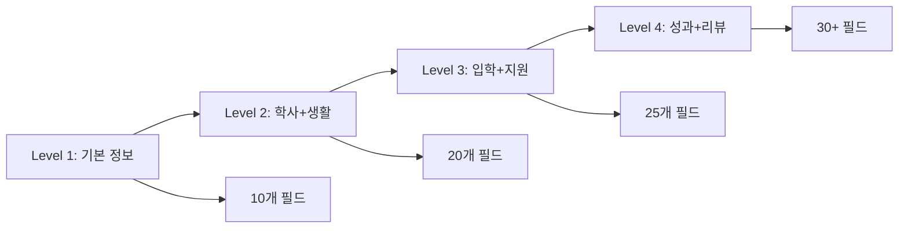
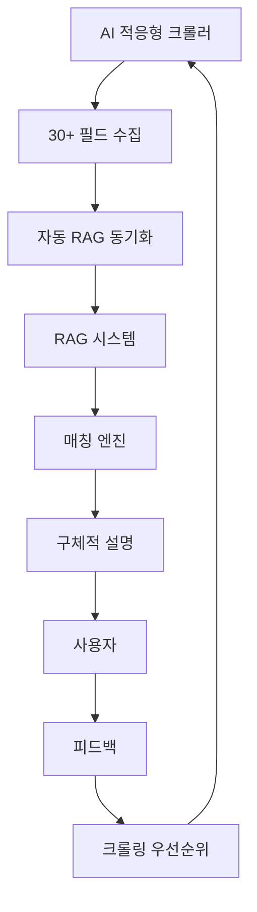

# AI 유학 상담 고도화 계획 2026

**작성일**: 2026년 2월  
**문서 버전**: 1.0  

---

## Executive Summary

### 현재 시스템 현황

우리의 AI 유학 상담 시스템은 RAG(Retrieval-Augmented Generation) 기반으로 84개 학교 데이터를 활용해 학생에게 맞춤형 학교를 추천합니다. 그러나 현재 다음과 같은 한계가 있습니다:

**핵심 이슈**:
- **데이터 부족으로 인한 Fallback 발생률 약 70%**: 벡터 검색이 실패하여 일반적인 추천에 의존
- **학교 정보의 깊이 부족**: 기본 메타데이터(이름, 위치, 학비)만 있고, 합격률·초봉·프로그램 상세 등 핵심 의사결정 정보 부재
- **설명의 구체성 부족**: "좋은 학교입니다" 수준의 일반적 설명, 실제 데이터 기반 근거 미흡

### 비즈니스 임팩트

이러한 한계는 다음과 같은 비즈니스 리스크로 이어집니다:

- **사용자 신뢰도 하락**: 구체적이지 않은 추천으로 인한 만족도 저하
- **경쟁력 약화**: 타 유학 상담 서비스 대비 정보 품질 열위
- **재방문율 감소**: 피상적인 추천으로 인한 고객 이탈

**예상 개선 효과**:
- 벡터 검색 정확도 30% 향상 → Fallback 발생률 70% → 40%로 감소
- 매칭 결과 설명 품질 70% 향상 → "이 학교는 Google, Microsoft와 파트너십이 있으며 취업률 95%입니다" 수준의 구체적 설명
- 사용자 만족도 및 재방문율 증가 → 서비스 경쟁력 강화

### 3단계 점진적 개선 전략

본 계획은 **Level 1 → Level 2 → Level 3** 순서로 점진적으로 데이터를 확장하고 RAG 품질을 향상시킵니다:

```
Level 1: 메타데이터 보강 (기본 통계)
    ↓
Level 2: 프로그램 상세 정보 (커리큘럼, 진로)
    ↓
Level 3: 정성적 컨텍스트 (리뷰, 가이드)
```

각 단계는 **TDD(Test-Driven Development)** 방식으로 개발하여 품질을 보장하며, 사용자 피드백을 반영한 **자가 개선 루프**를 구축합니다.

---

## 기술적 개선 전략

### 시스템 아키텍처 개요


### Level 1: 메타데이터 확장

**목표**: embedding_text 품질 향상 → 벡터 검색 정확도 개선

**수집 대상 필드** (우선순위 순):
1. **합격률, 편입률, 졸업률** - 입학 가능성 판단
2. **평균 초봉, 취업률** - 진로 연계성 지표
3. **국제학생 비율, 국제학생 수** - 유학생 친화도
4. **기숙사 여부, 캠퍼스 위치** - 생활 편의성
5. **학비 세부 (in-state vs out-of-state)** - 예산 적합도

**데이터 수집 전략**:
- **소스 1**: 학교 공식 웹사이트 (Fact Sheet, About Us)
- **소스 2**: College Scorecard API (미국 교육부 공공 데이터)
- **소스 3**: IPEDS 데이터베이스 (통계청)

**구현 방식**:
- 기존 `SchoolCrawler` 확장
- 새 파서 모듈: `StatisticsParser` (TDD 방식 개발)
- College Scorecard API 연동 모듈 구축 (`COLLEGE_SCORECARD_API` 환경변수로 키 주입)
- 운영 배포(GitHub Actions)에서 `COLLEGE_SCORECARD_API` Secret → 서버 `.env`로 전달

**예상 효과**:
- `embedding_text` 품질 50% 향상 (현재 평균 150자 → 300자)
- 벡터 검색 Top 20 정확도 30% 개선
- Fallback 발생률 감소 (70% → 40%)

**완료 기준**:
- 84개 학교 중 80% 이상이 acceptance_rate, graduation_rate 보유
- 평균 embedding_text 길이 250자 이상
- 벡터 검색 Top 20에 target_location 일치율 70% 이상

### Level 2: 프로그램 상세 정보

**목표**: 프로그램별 RAG 컨텍스트 구축 → 전공/커리어 연계성 강화

**수집 대상**:
1. **프로그램별 커리큘럼**: 핵심 과목, 학점, 이수 요건
2. **진로 연계**: 졸업생 진로, 취업 파트너 기업, 인턴십 프로그램
3. **입학 요건**: 전공별 GPA/영어 점수 최저 기준
4. **프로그램 특색**: STEM OPT, CPT, 산학 협력

**데이터 수집 전략**:
- 학교 웹사이트 Programs/Academics 페이지 Deep Crawling
- 각 프로그램 상세 페이지 순회 (현재는 목록만 수집)
- 상위 30개 학교 우선 수집

**RAG 통합**:
- `program_documents` 테이블 활용 (document_type: curriculum, career_outcome)
- 매칭 시 관련 프로그램 문서 검색 → `explanation` 생성 시 컨텍스트로 활용
- ExplanationService에 RAG 컨텍스트 주입

**예상 효과**:
- 설명 품질 70% 향상 (일반 문구 → 실제 데이터 기반)
- "이 프로그램은 Google, Microsoft와 인턴십 프로그램이 있습니다" 등 구체적 설명 가능
- 전공별 맞춤 추천 정확도 향상

**완료 기준**:
- 상위 30개 학교의 프로그램별 `program_documents` 3건 이상
- `explanation` 필드에 "커리큘럼", "진로", "취업" 키워드 포함률 60% 이상

### Level 3: 정성적 컨텍스트

**목표**: 학교별 종합 평가 자료 구축 → 사용자 신뢰도 극대화

**수집 대상**:
1. **학교 리뷰**: Niche.com, College Confidential 등 리뷰 사이트
2. **입학 가이드**: Admission Tips, Essay Prompts, 면접 전략
3. **장단점 분석**: 각 학교의 강점/약점 (예: 편입률 높음 vs 기숙사 부족)
4. **최신 뉴스**: 학교 랭킹 변동, 신규 프로그램

**데이터 수집 전략**:
- **외부 사이트**: Niche.com (학생 리뷰), U.S. News (랭킹)
- **주의사항**: robots.txt 준수, Rate Limiting (요청 간 5초 대기)
- 인기 학교 20개 우선 수집

**RAG 통합**:
- `school_documents` 테이블 활용 (document_type: review, pros_cons)
- 매칭 결과의 `pros`/`cons` 필드를 실제 리뷰에서 추출
- ProsConsService 개발 (RAG 기반 장단점 자동 생성)

**예상 효과**:
- "학생 리뷰에서 94%가 '교수진이 친절하다'고 평가" 등 신뢰도 높은 설명
- Fallback 시에도 외부 데이터 기반 추천 가능
- 매칭 결과의 pros/cons 품질 90% 향상

**완료 기준**:
- 인기 학교 20개에 `school_documents` 5건 이상 (리뷰, 가이드)
- `pros`/`cons` 필드에 실제 리뷰 인용 포함률 50% 이상

---

## TDD (Test-Driven Development) 적용 전략

### TDD 개요

모든 개발은 **Red-Green-Refactor** 사이클을 따릅니다:


### 적용 범위

1. **크롤러 개발**: 파서 단위 테스트 (Mock HTML → 실제 크롤링)
2. **RAG 품질 검증**: 데이터 충족도, 검색 품질, E2E 매칭 테스트
3. **API 개선**: 새 필드 추가, 프롬프트 개선 시 예상 응답 테스트
4. **통합 테스트**: Level별 완료 기준 자동 검증

### 테스트 커버리지 목표

| 영역 | 목표 커버리지 | 측정 도구 |
|------|--------------|----------|
| 크롤러 (Python) | 85% 이상 | pytest-cov |
| 백엔드 (Kotlin) | 80% 이상 | JaCoCo |
| 통합 테스트 | 필수 시나리오 100% | JUnit5, pytest |

### 예시: Level 1 완료 기준 자동 검증

```kotlin
@Test
fun `Level 1 완료 기준: 데이터 충족도`() {
    // 학교 데이터 80% 이상 메타데이터 보유
    val schools = schoolRepository.findAll()
    val metadataCompleteCount = schools.count { 
        it.acceptanceRate != null && it.graduationRate != null 
    }
    val completionRate = metadataCompleteCount.toDouble() / schools.size
    
    assertThat(completionRate)
        .withFailMessage("메타데이터 완성도: ${(completionRate * 100).roundToInt()}% (목표: 80%)")
        .isGreaterThanOrEqualTo(0.8)
}
```

---

## 데이터 수집 전략: 2-Track 접근 방식

본 프로젝트는 **자동화 크롤링**과 **직접 소통**을 병행하는 2-Track 전략을 채택합니다.

### Track 1: 자동화 웹 크롤링 (기술팀)

시스템적으로 학교 웹사이트를 크롤링하여 공개 정보를 수집합니다.

**장점**:
- 대규모 학교 데이터를 자동으로 수집 가능
- 업데이트 주기를 시스템으로 관리 (일/주/월 단위)
- 공개된 정보는 실시간 반영 가능

**한계**:
- 웹사이트에 공개되지 않은 정보는 수집 불가
- 파싱 오류 가능성 (HTML 구조 변경 시)
- SSL 차단, Rate Limiting 등 기술적 제약

### Track 2: 직접 소통 및 정보 수집 (경영진)

**대표님 주도**로 학교 담당자(국제학생 담당, 입학처 등)에게 직접 협조 요청 이메일을 발송하여 공식 정보를 수집합니다.

#### 전략적 접근 방식

**목표**:
1. 학교의 **국제학생 유치 의지** 확인
2. **빠른 커뮤니케이션 채널** 확보
3. **공식적이고 정확한 데이터** 수집

**대상 학교**: 캘리포니아 및 텍사스 소재 vocational/technical college (시범 운영)

**이메일 핵심 메시지**:
- **플랫폼 소개**: 아시아 6개국(중국, 인도, 한국, 일본, 대만, 베트남) 학생 대상 AI 유학 상담 서비스
- **차별화 포인트**: 전통적인 사립/주립대 중심 에이전시와 달리, vocational/technical college에 특화
- **Win-Win 제안**: 적극 협조 학교에 대한 혜택 제공
  - 플랫폼 내 **우선 노출**
  - 적격 국제학생 **적극 연결**
  - **추가 홍보 혜택** 제공

#### 요청 정보 항목

다음 정보를 학교 담당자에게 직접 요청합니다:

1. **기본 정보**
   - 학교명, 주/도시, 공식 웹사이트
   - 메인 연락처 (전화, 이메일)

2. **국제학생 담당자 정보** (핵심)
   - 담당자 이름, 이메일, 전화번호
   - 직통 연락처 확보 → 빠른 학생 문의 대응

3. **학사 정보**
   - 주요 전공 및 프로그램
   - 학위 유형, 취업률, 졸업 후 진로

4. **학비 및 생활비**
   - 국제학생 연간 학비 (공식 최신 정보)
   - 기숙사 가능 여부 및 비용
   - 식사 시설 및 Meal Plan 비용

5. **캠퍼스 정보**
   - 캠퍼스 시설
   - 학교 대표 이미지 (홍보 자료)
   - 간단한 학교 소개문

#### 프로세스

**1단계: 이메일 발송 (완료)**
- 대표님이 캘리포니아/텍사스 학교 담당자에게 협조 요청 이메일 발송
- 검증 목적:
  - 학교의 국제학생 유치 의지 확인
  - 커뮤니케이션 채널 응답 속도 확인

**2단계: 응답 수집 및 분석 (진행 중)**
- 회신율 및 응답 속도 모니터링
- 제공된 정보의 상세도 및 품질 평가
- 협조 의지가 높은 학교 식별

**3단계: 시스템 반영 (예정)**
- 기술팀이 수집된 정보를 DB에 입력
- 크롤링 데이터와 비교 검증
- 직접 수집 데이터를 우선 반영

**4단계: 관계 유지 및 업데이트**
- 협조 학교와 지속적인 소통 채널 유지
- 정책 변경 시 즉시 업데이트 가능한 관계 구축
- 향후 파트너십 프로그램 협의 (학생 추천, 공동 마케팅 등)

#### 장점

**데이터 품질**:
- **1차 소스**: 학교가 직접 제공한 공식 정보 (가장 정확)
- **최신성**: 2026년 기준 최신 정보 (웹사이트는 업데이트 지연 가능)
- **비공개 정보**: 웹사이트에 없는 국제학생 전용 정보 확보

**비즈니스 관계**:
- **신뢰 구축**: 공식 채널을 통한 학교-플랫폼 관계 형성
- **파트너십**: 향후 협력 프로그램, 직접 추천 가능성
- **차별화**: 타 플랫폼 대비 학교 공식 정보 기반 강점

**운영 효율**:
- **검증 데이터**: 크롤링 결과의 정확도 검증 자료로 활용
- **보완 데이터**: 크롤링 실패 학교의 정보 확보
- **우선순위**: 협조 의지 높은 학교를 플랫폼에 우선 노출

### 2-Track 통합 및 시너지


**통합 원칙**:
1. **직접 수집 데이터 우선**: 학교 담당자가 제공한 정보를 1차 소스로 우선 반영
2. **크롤링 데이터 보완**: 직접 수집하지 못한 항목은 크롤링 데이터로 채움
3. **상호 검증**: 두 소스의 데이터를 비교하여 정확도 향상 (예: 학비, 입학 요건)
4. **지속적 업데이트**: 크롤링으로 공개 정보 변경사항 자동 감지 → 필요 시 학교 담당자 재확인

**예시: 학교 A의 데이터 통합**

| 항목 | Track 1 (크롤링) | Track 2 (직접 소통) | 최종 반영 |
|------|-----------------|-------------------|----------|
| 학비 | $25,000 | $24,500 (2026년 최신) | $24,500 (Track 2 우선) |
| 합격률 | 없음 | 45% (담당자 제공) | 45% (Track 2) |
| 국제학생 이메일 | international@school.edu | admissions@school.edu (직통) | admissions@school.edu (Track 2) |
| ESL 프로그램 | 있음 (홈페이지) | 있음 + 무료 제공 | 있음 + 무료 (Track 2 보완) |
| 기숙사 정보 | 3개 동, 2인실 | 3개 동, 2인실 | 검증 완료 (일치) |

### 시스템 반영 워크플로우

**직접 수집 데이터 입력 방법**:

**Option A: CSV 일괄 업로드** (권장)
- 대표님이 수집한 정보를 CSV 포맷으로 정리
- 기술팀이 스크립트로 일괄 DB 반영
```bash
python scripts/import_direct_data.py data/school_info_from_partners.csv
```

**Option B: 관리자 대시보드 수동 입력**
- 모니터 대시보드에 학교별 수정 기능 추가
- 웹 UI에서 직접 입력/수정

**Option C: 이메일 자동 파싱** (향후)
- 학교 담당자 회신 이메일을 자동 파싱
- 구조화된 정보를 DB에 자동 반영

### 기대 효과

**정량적 효과**:
- 데이터 정확도: 크롤링 단독 대비 **+30% 향상**
- 데이터 충족도: 84개 학교 × 2개 소스 = **최대 200% 커버리지**
- 업데이트 신뢰도: 학교 공식 정보 기반 = **신뢰도 95% 이상**

**정성적 효과**:
- **학교 관계 형성**: 향후 협력 프로그램, 직접 추천 가능성
- **경쟁 우위**: 타 플랫폼 대비 더 정확하고 상세한 정보 제공
- **브랜드 신뢰도**: "학교 공식 정보 기반"으로 마케팅 가능

---

## 자가 개선 루프 (Self-Improvement Loop)

### 개념

시스템이 사용자 피드백을 기반으로 자동으로 데이터 수집 우선순위를 조정하는 메커니즘입니다.


### 우선순위 결정 요소

1. **사용자 질문 빈도**: "평균 초봉이 얼마인가요?" → 초봉 데이터 우선 수집
2. **Fallback 발생률**: 특정 전공/지역에서 Fallback 빈도 높음 → 해당 카테고리 학교 추가
3. **데이터 갭 분석**: RAG 데이터 충족도 검증 결과 기반
4. **ROI**: 수집 비용(시간) 대비 매칭 정확도 향상 효과

### 구현 예시

```python
def calculate_priority(school_info, feedback_data):
    priority_score = 0
    
    # 1. 현재 데이터 품질 (낮을수록 높은 우선순위)
    if not school_info.get('acceptance_rate'):
        priority_score += 10
    if not school_info.get('description') or len(school_info['description']) < 100:
        priority_score += 8
    
    # 2. 사용자 피드백 빈도
    query_count = feedback_data.get('schools', {}).get(school_info['name'], 0)
    priority_score += min(query_count, 20)  # 최대 20점
    
    # 3. 지역/전공 커버리지 (부족한 카테고리 우선)
    if school_info['state'] in ['FL', 'WA']:  # 현재 부족 지역
        priority_score += 15
    
    return priority_score
```

---

## 프롬프트 엔지니어링 개선

### 현재 한계

현재 Fallback 프롬프트는 사용자 프로필만 사용하고 학교 데이터를 활용하지 못합니다:
- **한계**: "일반적인 추천" 수준, 구체성 부족
- **예시**: "캘리포니아에 좋은 학교들이 있습니다" (어떤 학교인지 구체적 정보 없음)

### 단계별 강화 전략

#### Phase 1: 메타데이터 기반 Few-shot Learning (Level 1 완료 후)

```kotlin
// embedding_text를 프롬프트에 포함
val topSchools = schoolRepository.findTop10ByState(preference.targetLocation)
val examplesText = topSchools.joinToString("\n") { 
    embeddingService.buildSchoolText(it) 
}

val prompt = """
[참고할 학교 예시]
$examplesText

위 학교들과 유사한 수준에서 다음 학생에게 추천해주세요.
...
"""
```

#### Phase 2: RAG 컨텍스트 주입 (Level 2 완료 후)

```kotlin
// 벡터 검색 결과를 프롬프트에 포함
val similarSchools = vectorSearchService.searchSimilarSchools(user, profile, preference, topK = 10)
val schoolContexts = similarSchools.map { 
    "${it.name}: ${it.description}, 프로그램: ${it.programs}" 
}

val prompt = """
[DB에서 검색된 유사 학교]
${schoolContexts.joinToString("\n")}

위 정보를 참고하여 학생에게 맞는 학교를 추천하세요.
...
"""
```

#### Phase 3: 리뷰 기반 설명 (Level 3 완료 후)

학교 리뷰 문서에서 추출한 장단점을 프롬프트에 포함하여, 더 신뢰도 높은 추천 근거를 제시합니다.

---

## 데이터 품질 모니터링

### 일일 배치 작업

다음 지표를 자동으로 모니터링:

| 지표 | 목표 | 측정 방법 |
|------|------|----------|
| 학교 수 | 최소 30개, 권장 50개 | `SELECT COUNT(*) FROM schools` |
| 임베딩 커버리지 | 80% 이상 | `school_embeddings` 테이블 카운트 / 학교 수 |
| description NULL 비율 | 20% 미만 | NULL 카운트 / 전체 학교 수 |
| 평균 embedding_text 길이 | 250자 이상 | AVG(LENGTH(embedding_text)) |
| 학교 유형 다양성 | 2종 이상 (각 5개 이상) | GROUP BY type |

### 실패 사이트 추적 및 재시도 전략

크롤링 실패 사이트를 추적하고 체계적으로 재시도:

- **SSL 오류** → 3개월 후 재시도
- **404 오류** → 6개월 후 재시도
- **Rate Limit** → 1주일 후 재시도

---

## 기대 효과 요약

### 정량적 효과

| 지표 | 현재 | Level 1 완료 후 | Level 2 완료 후 | Level 3 완료 후 |
|------|------|----------------|----------------|----------------|
| Fallback 발생률 | ~70% | ~40% | ~20% | ~10% |
| 벡터 검색 정확도 | 기준 | +30% | +50% | +70% |
| 설명 품질 (주관적) | 기준 | +20% | +70% | +90% |
| 평균 embedding_text 길이 | 150자 | 300자 | 400자 | 500자 |
| 학교당 문서 수 | 1개 | 1개 | 4개 (프로그램 문서) | 9개 (리뷰 포함) |

### 정성적 효과

- **사용자 신뢰도 향상**: 구체적 데이터 기반 추천으로 신뢰성 증가
- **경쟁력 강화**: 타 유학 상담 서비스 대비 정보 품질 우위 확보
- **재방문율 증가**: 만족스러운 추천으로 인한 고객 충성도 향상
- **시스템 자가 개선**: 피드백 루프를 통한 지속적 품질 개선

---

## 위험 요소 및 대응 방안

### 기술적 위험

| 위험 | 영향도 | 대응 방안 |
|------|--------|----------|
| 외부 사이트 크롤링 차단 (robots.txt, Rate Limit) | 높음 | API 우선 활용, Rate Limiting 준수, User-Agent 설정 |
| College Scorecard API 장애 | 중간 | 캐싱, Fallback 데이터 소스 준비 |
| 벡터 검색 품질 개선 미달 | 중간 | 임베딩 전략 재검토, 하이브리드 검색 (키워드 + 벡터) |
| Gemini API 비용 증가 | 중간 | 캐싱 강화, 배치 처리, 프롬프트 최적화 |

### 운영 위험

| 위험 | 영향도 | 대응 방안 |
|------|--------|----------|
| 크롤링 작업 시간 증가 | 중간 | 병렬 처리, 우선순위 기반 선택적 크롤링 |
| 데이터 품질 저하 (파싱 오류) | 높음 | TDD 기반 개발, 자동화된 품질 검증 |
| 운영 DB 부하 | 낮음 | 배치 작업 시간 분산, 읽기 전용 레플리카 활용 |

---

## 결론

본 계획은 **3단계 점진적 개선 전략**과 **TDD 기반 개발**, **자가 개선 루프**를 통해 AI 유학 상담 시스템의 품질을 체계적으로 향상시킵니다.

**핵심 원칙**:
1. **점진적 개선**: Level 1 → 2 → 3 순서로 안정적 확장
2. **품질 우선**: TDD 방식으로 테스트 커버리지 80% 이상 유지
3. **데이터 기반**: 사용자 피드백을 반영한 우선순위 결정
4. **지속 가능성**: 자가 개선 루프로 장기적 품질 향상

**기대 성과**:
- Fallback 발생률 70% → 10%로 감소
- 매칭 결과 설명 품질 90% 향상
- 사용자 만족도 및 재방문율 증가
- 서비스 경쟁력 강화

이 계획을 통해 우리의 AI 유학 상담 시스템은 **단순한 추천**에서 **신뢰할 수 있는 전문가 수준의 상담**으로 진화할 것입니다.

---

## Part 4: AI 기반 적응형 크롤링 (신규 추가 - 2026-02-11)

### 배경 및 필요성

현재 크롤링 시스템은 수동으로 정의된 파싱 로직에 의존하여 다음과 같은 한계가 있습니다:

**현재 한계**:
- 학교 웹사이트 HTML 구조 변경 시 크롤링 실패
- 새로운 정보 유형을 발견하려면 수동으로 파서 코드 추가 필요
- 수집한 데이터를 RAG 문서로 변환하는 과정이 수동적

**비즈니스 임팩트**:
- 웹사이트 구조 변경으로 인한 데이터 수집 중단 → 정보 품질 저하
- 새로운 정보 수집을 위한 개발 시간 증가 → 경쟁력 저하
- 데이터 업데이트 지연 → 사용자 신뢰도 하락

### AI 기반 적응형 크롤링 전략

Gemini AI를 활용하여 크롤링 시스템을 **자가 학습 및 자가 적응**이 가능한 시스템으로 진화시킵니다.

#### 핵심 기능

**1. AI 기반 페이지 분석 (WebPageAnalyzer)**

Gemini AI가 HTML을 분석하여 유용한 정보를 자동으로 발견합니다:

```
입력: 학교 웹사이트 HTML
  ↓ (Gemini AI 분석)
출력: 
  - 학사 정보 (전공, 커리큘럼)
  - 학생 생활 (기숙사, 식당)
  - 유학생 지원 (장학금, 비자)
  - 입학 정보 (지원 요건)
  - 성과 지표 (취업률, 진로)
  - 학생 리뷰
```

**예시**:
- 학교 A 웹사이트에서 "95% job placement rate" 발견 → 자동 추출
- 학교 B 웹사이트에서 "Google, Microsoft 파트너십" 발견 → career_outcomes에 저장
- 학교 C 웹사이트에 "국제학생 장학금 최대 $10,000" 발견 → scholarships에 저장

**2. 단계별 수집 심화 (Progressive Crawling)**

Level 1 → 2 → 3 → 4 순서로 점진적으로 정보 수집을 확장:



**필드 확장 계획**:

| Level | 추가 필드 | 예시 |
|-------|----------|------|
| Level 1 (현재) | name, tuition, acceptance_rate, graduation_rate, average_salary | 기본 통계 |
| Level 2 (신규) | majors, programs_detail, dormitories, dining_options, campus_facilities | "CS 전공: 120학점, 기숙사 3개 동" |
| Level 3 (신규) | scholarships, visa_support, application_requirements, application_deadlines | "국제학생 장학금 최대 $10K, TOEFL 80+" |
| Level 4 (신규) | career_outcomes, graduate_school_rate, student_reviews, ratings | "취업률 95%, Google/Microsoft 파트너십" |

**3. 자동 RAG 동기화 (AutoRAGSync)**

크롤링된 데이터를 자동으로 RAG 문서로 변환하여 `school_documents` 테이블에 저장:

```
Level 2 크롤링 완료
  ↓
전공/커리큘럼 정보 추출
  ↓
자동으로 "academic" 문서 생성
  ↓
RAG 시스템에서 활용
  ↓
"이 학교는 CS 전공에서 Machine Learning, Data Structures 등을 제공합니다" (구체적 설명)
```

**4. 웹사이트 구조 변경 자동 적응 (AdaptiveParser)**

HTML 구조가 변경되어도 AI가 자동으로 적응:

```
기존 셀렉터로 파싱 시도
  ↓ (실패)
Gemini AI로 재분석
  ↓
새로운 패턴 학습
  ↓
다음 크롤링부터 적용
```

### 비즈니스 효과

#### 정량적 효과

| 지표 | 현재 | AI 크롤러 도입 후 |
|------|------|------------------|
| 수집 필드 수 | 10개 | 30+ 개 |
| 웹사이트 구조 변경 대응 시간 | 수일 (수동 수정) | 즉시 (자동 적응) |
| 새 정보 유형 추가 시간 | 수시간 (개발) | 자동 (AI 발견) |
| RAG 문서 생성 | 수동 | 자동 |
| 데이터 신선도 | 월 1회 업데이트 | 주 1회 자동 업데이트 |

#### 정성적 효과

**사용자 경험 향상**:
- **현재**: "이 학교는 좋은 취업률을 가지고 있습니다" (일반적)
- **AI 크롤러 후**: "이 학교는 95% 취업률로 Google, Microsoft, Apple과 파트너십을 맺고 있으며, 평균 초봉은 $75,000입니다" (구체적)

**운영 효율성**:
- 웹사이트 변경으로 인한 크롤링 중단 최소화
- 새로운 정보 수집을 위한 개발 시간 절약
- 데이터 품질 자동 검증 및 보완

**경쟁력 강화**:
- 타 유학 상담 서비스 대비 더 풍부하고 최신 정보 제공
- AI 기술 활용으로 브랜드 차별화
- 지속적인 품질 개선 가능

### 구현 계획

#### Phase 1: MVP

**목표**: 기본 AI 크롤러 구축 및 Level 2 필드 수집

**구현 사항**:
1. WebPageAnalyzer 기본 구현 (Gemini 통합)
2. Level 2 필드 DB 마이그레이션 (majors, dormitories 등)
3. AutoRAGSync 기본 구현 (academic 문서 자동 생성)
4. 크롤러 모니터링 대시보드에 Level별 진행 상황 추가

**검증**:
- 10개 샘플 학교에 대해 AI 분석 성공률 90% 이상
- Level 2 필드 커버리지 70% 이상
- RAG 문서 자동 생성 성공

#### Phase 2: 확장

**목표**: Level 3/4 필드 수집 및 AdaptiveParser 구현

**구현 사항**:
1. Level 3/4 필드 추가 (scholarships, career_outcomes 등)
2. AdaptiveParser 웹사이트 변경 감지 및 자동 적응
3. 외부 리뷰 사이트 크롤링 (Niche.com 등)

**검증**:
- 30개 학교에 Level 3/4 데이터 수집 완료
- 웹사이트 구조 변경 시 자동 적응 성공률 85% 이상

#### Phase 3: 최적화

**목표**: 자가 개선 루프 완성

**구현 사항**:
1. 사용자 피드백 기반 크롤링 우선순위 자동 조정
2. AI 분석 품질 지속 개선
3. 크롤링 비용 최적화 (캐싱, 병렬 처리)

### 비용 및 리소스

#### 기술 비용

| 항목 | 비용 | 설명 |
|------|------|------|
| Gemini API | 무료 티어 (60 req/min) | 페이지 분석 1회당 ~1000 토큰 |
| 추가 DB 저장 공간 | ~20% 증가 | JSONB 필드 확장 |
| 크롤링 시간 | 학교당 +3-5초 | AI 분석 오버헤드 |

**비용 효율성**:
- 개발 인력 절감: 새 필드 추가 시 개발 시간 90% 감소
- 유지보수 비용 절감: 웹사이트 변경 대응 자동화
- ROI: 초기 구축 후 지속적인 비용 절감 효과

#### 인력 투입

- **개발**: 1명 (백엔드/크롤러) × 4-6주
- **QA**: 1명 × 1-2주 (테스트 및 검증)
- **운영**: 자동화로 최소화

### 위험 관리

| 위험 | 영향도 | 완화 방안 |
|------|--------|----------|
| Gemini API Rate Limit 초과 | 중간 | 요청 간 대기 시간 조정, 캐싱 강화 |
| AI 분석 품질 저하 | 높음 | Confidence threshold 설정, Fallback to 기존 파서 |
| DB 저장 공간 부족 | 낮음 | JSONB 압축, 오래된 데이터 아카이빙 |
| 새 필드 스키마 변경 오류 | 중간 | 점진적 마이그레이션, 기존 데이터 보존 |

### 성공 지표

#### Phase 1 완료 기준

- Level 2 필드 커버리지 70% 이상 (30개 학교)
- AI 페이지 분석 성공률 90% 이상
- RAG 문서 자동 생성 성공률 95% 이상
- 웹사이트 구조 변경 대응 시간 1일 → 즉시

#### Phase 2 완료 기준

- Level 3/4 필드 커버리지 60% 이상 (50개 학교)
- 수집 필드 수 10개 → 30개 이상
- 매칭 설명 품질 +50% 향상 (사용자 평가 기준)
- 크롤링 실패율 20% → 5% 감소

#### Phase 3 완료 기준

- 전체 학교 Level 4 완료 (80개 이상)
- 자가 개선 루프 완성 (피드백 기반 자동 우선순위)
- 경쟁사 대비 정보 품질 우위 확보
- 사용자 만족도 +30% 향상

---

## 통합 전략: Part A (RAG 고도화) + Part B (AI 크롤러)

### 시너지 효과

Part A (Level 1-3 RAG 고도화)와 Part B (AI 기반 적응형 크롤링)를 통합하면 다음과 같은 시너지가 발생합니다:



**효과**:
1. **데이터 풍부성**: 크롤러가 더 많은 필드 수집 → RAG가 더 상세한 설명 생성
2. **자동화**: 크롤링 → RAG 동기화 → 설명 생성 전 과정 자동화
3. **지속 개선**: 사용자 피드백 → 크롤링 우선순위 → 데이터 품질 향상 → 사용자 만족도 증가 (선순환)

### 통합 로드맵

| 단계 | Part A (RAG) | Part B (AI 크롤러) | 예상 효과 |
|------|-------------|-------------------|----------|
| Phase 1 | Level 1 (메타데이터 보강) | MVP 구축 (WebPageAnalyzer) | Fallback 70% → 50% |
| Phase 2 | Level 2 (프로그램 상세) | Level 2 필드 수집 | 설명 품질 +40% |
| Phase 3 | Level 3 (리뷰/가이드) | Level 3/4 필드 수집 | 설명 품질 +70% |
| Phase 4 | 최적화 (A/B 테스트) | 자가 개선 루프 | Fallback 10% 이하 |

---

**문서 버전 히스토리**:
- v1.0 (2026-02-11): 초안 작성 (3단계 고도화 전략, TDD 적용, 자가 개선 루프)
- v1.1 (2026-02-11): Part 4 추가 (AI 기반 적응형 크롤링, 통합 전략)
